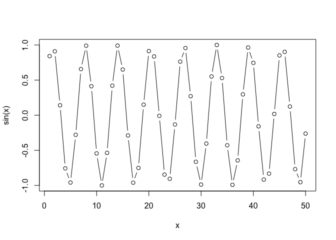
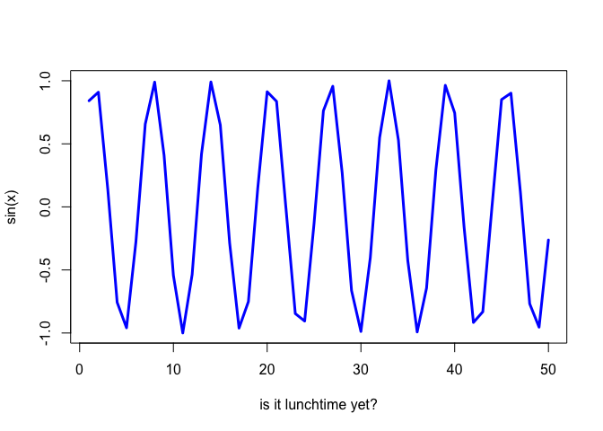

# Class 4
Emma Bell

``` r
x <- 1:50
```

# command return to get the script onto the console

``` r
plot(x)
```


``` r
plot(x, sin(x))
```


``` r
plot(x, sin(x), typ="b")
```



``` r
plot(x, sin(x), typ="l", col="blue", lwd=3, xlab="is it lunchtime yet?")
```


