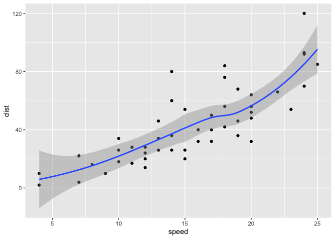
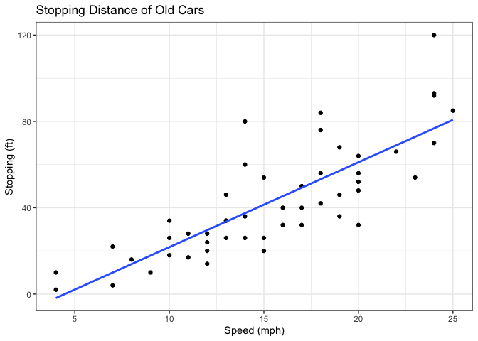
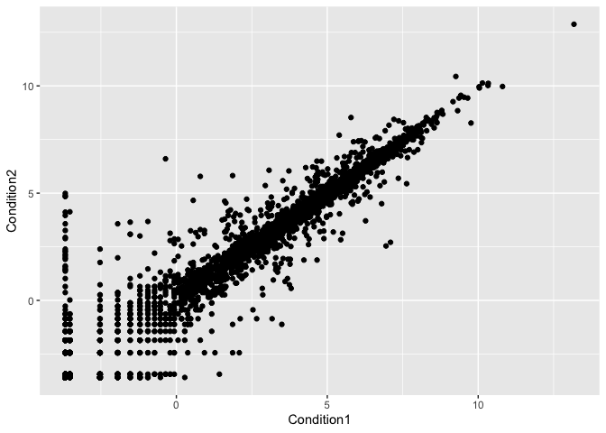
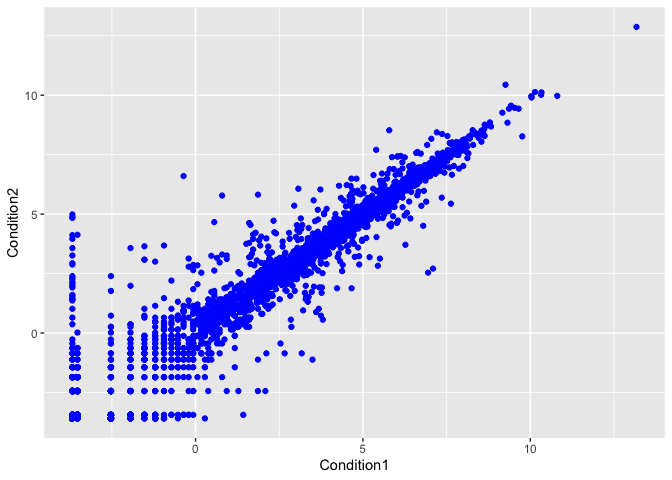
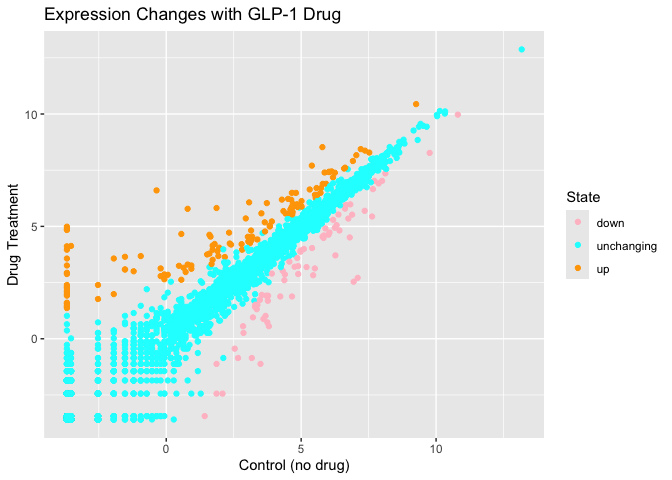
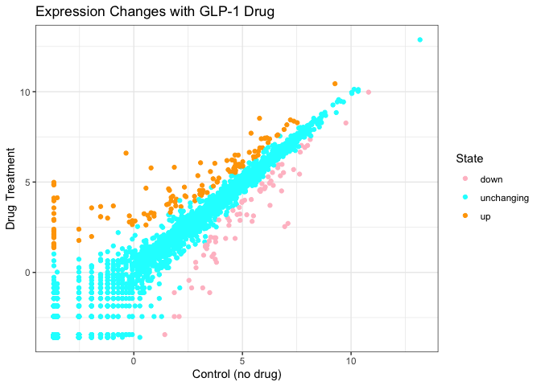
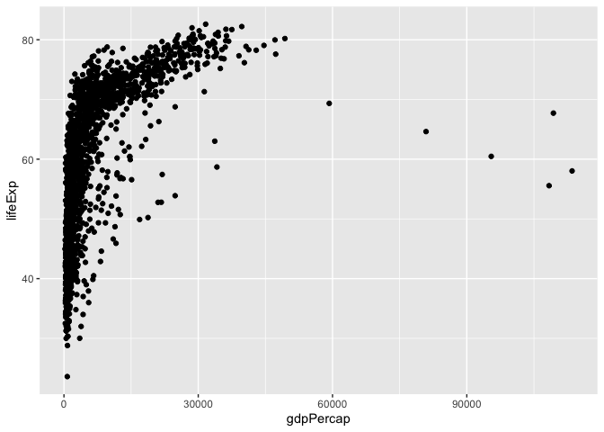

# Class 5: Data Vis with ggplot
Emma Bell (PID:A19247017)

- [Background](#background)
- [Gene Expression Plot](#gene-expression-plot)
- [Going Further with Gapminder](#going-further-with-gapminder)
- [First look at the dplr package](#first-look-at-the-dplr-package)

## Background

There are lots of ways to make visualisations and plots in R. These
include so called “base R” (like the `plot()`) and add on pakages like
**ggplot2**.

Let’s make the same plot with these two graphic systems. We can use the
inbuilt `cars` dataset:

``` r
head(cars)
```

      speed dist
    1     4    2
    2     4   10
    3     7    4
    4     7   22
    5     8   16
    6     9   10

(You can use tail for the last 6 of the data set)

With “base R” we can simply:

``` r
plot(cars)
```


Now let’s try ggplot. First I need to install the package using
`install.packages("ggplot2")`.

> **N\>B** We never run an `install.packages()` in a code chunk
> otherwise we will re-install needlessly everytime we render our
> document.

Everytime we want to use an add-on package we need to load it up with a
call to `library()`

``` r
library(ggplot2)
ggplot(cars)
```


Every ggplot needs at least three things: 1. The **data** ie stuff to
plot as a data.frame 2. The **aes** or aesthetics that map the data to
the plot 3. The **geom\_** or geometry ie the plot type such as points,
lines etc

``` r
ggplot(cars) + aes(x = speed, y = dist) + geom_point()
```


``` r
ggplot(cars) + aes(x=speed, y=dist) + geom_point() + geom_smooth()
```

    `geom_smooth()` using method = 'loess' and formula = 'y ~ x'



``` r
ggplot(cars) + aes(x=speed, y=dist) + geom_point() + geom_smooth(method=lm, se=FALSE)
```

    `geom_smooth()` using formula = 'y ~ x'


``` r
ggplot(cars) + aes(x=speed, y=dist) + geom_point() + geom_smooth(method=lm, se=FALSE) + labs(x="Speed (mph)", y="Stopping (ft)", title= "Stopping Distance of Old Cars") + theme_bw()
```

    `geom_smooth()` using formula = 'y ~ x'



## Gene Expression Plot

Read some data on the effects of GLP-1 inhibitor (drug) on gene
expression values.

``` r
url <- "https://bioboot.github.io/bimm143_S20/class-material/up_down_expression.txt"
genes <- read.delim(url)
head(genes)
```

            Gene Condition1 Condition2      State
    1      A4GNT -3.6808610 -3.4401355 unchanging
    2       AAAS  4.5479580  4.3864126 unchanging
    3      AASDH  3.7190695  3.4787276 unchanging
    4       AATF  5.0784720  5.0151916 unchanging
    5       AATK  0.4711421  0.5598642 unchanging
    6 AB015752.4 -3.6808610 -3.5921390 unchanging

Version 1 plot - start simple by getting some ink on the page.

``` r
ggplot(genes) +
  aes(Condition1, Condition2 ) +
  geom_point()
```



``` r
ggplot(genes) +
  aes(Condition1, Condition2 ) +
  geom_point(col="blue")
```



``` r
ggplot(genes) +
  aes(Condition1, Condition2 ) +
  geom_point(col="blue", alpha=0.2)
```


Let’s colour by `State` up, down or not changing.

``` r
ggplot(genes) +
  aes(Condition1, Condition2, col=State ) +
  geom_point() + scale_color_manual(values = c("pink", "cyan", "orange")) + labs(x= "Control (no drug)", y= "Drug Treatment", title="Expression Changes with GLP-1 Drug")
```



``` r
ggplot(genes) +
  aes(Condition1, Condition2, col=State ) +
  geom_point() + scale_color_manual(values = c("pink", "cyan", "orange")) + labs(x= "Control (no drug)", y= "Drug Treatment", title="Expression Changes with GLP-1 Drug") + theme_bw()
```



``` r
nrow(genes)
```

    [1] 5196

``` r
ncol(genes)
```

    [1] 4

``` r
table(genes$State)
```


          down unchanging         up 
            72       4997        127 

``` r
round(table(genes$State)/nrow(genes)*100, 2)
```


          down unchanging         up 
          1.39      96.17       2.44 

## Going Further with Gapminder

Here we explore the famous `gapminder` dataset with some custom plots.

``` r
# File location online
url <- "https://raw.githubusercontent.com/jennybc/gapminder/master/inst/extdata/gapminder.tsv"

gapminder <- read.delim(url)
head(gapminder)
```

          country continent year lifeExp      pop gdpPercap
    1 Afghanistan      Asia 1952  28.801  8425333  779.4453
    2 Afghanistan      Asia 1957  30.332  9240934  820.8530
    3 Afghanistan      Asia 1962  31.997 10267083  853.1007
    4 Afghanistan      Asia 1967  34.020 11537966  836.1971
    5 Afghanistan      Asia 1972  36.088 13079460  739.9811
    6 Afghanistan      Asia 1977  38.438 14880372  786.1134

> Q. How many rows does this dataset have?

``` r
nrow(gapminder)
```

    [1] 1704

> How many different continents are in this dataset?

``` r
table(gapminder$continent)
```


      Africa Americas     Asia   Europe  Oceania 
         624      300      396      360       24 

Version 1 plot gdpPercap vs LifeExp for all rows

``` r
ggplot(gapminder) + aes(gdpPercap, lifeExp) + geom_point()
```



``` r
ggplot(gapminder) + aes(gdpPercap, lifeExp, color= continent) + geom_point() 
```


I want to see a separate plot for each continent - in ggplot lingo this
is called “faceting”

``` r
ggplot(gapminder) + aes(gdpPercap, lifeExp, color= continent) + geom_point() + 
  facet_wrap(~continent)
```


## First look at the dplr package

Another add on package with a function called `filter()` that we want to
use.

``` r
library(dplyr)
```


    Attaching package: 'dplyr'

    The following objects are masked from 'package:stats':

        filter, lag

    The following objects are masked from 'package:base':

        intersect, setdiff, setequal, union

``` r
filter(gapminder, year==2007, country=="United Kingdom")
```

             country continent year lifeExp      pop gdpPercap
    1 United Kingdom    Europe 2007  79.425 60776238  33203.26

``` r
input <- filter(gapminder, year==2007 | year == 1977)
```

``` r
ggplot(input) + aes(gdpPercap, lifeExp, col=continent) + geom_point() + facet_wrap(~year)
```


