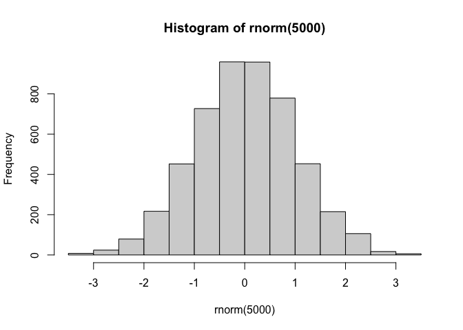
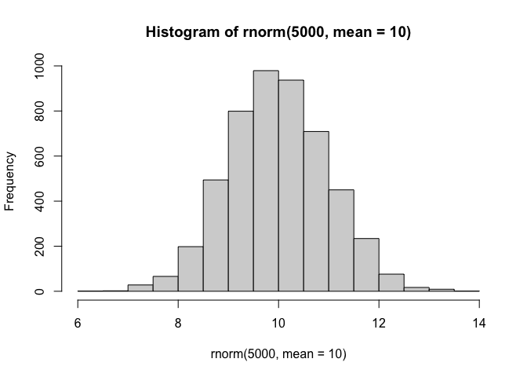
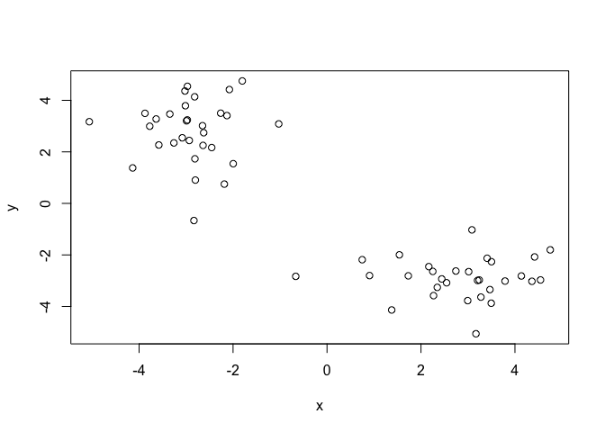
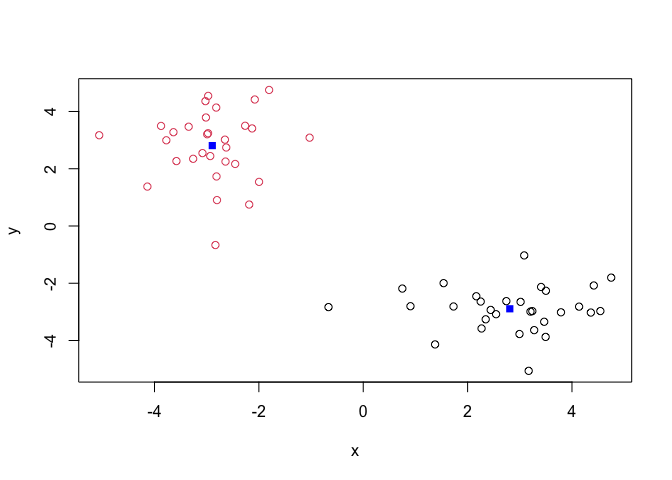
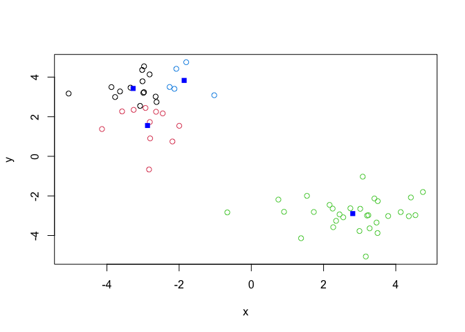
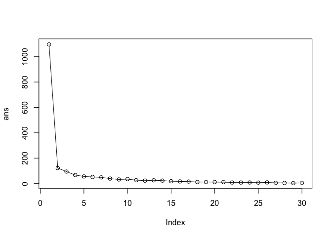
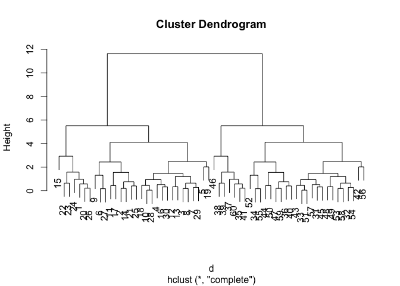
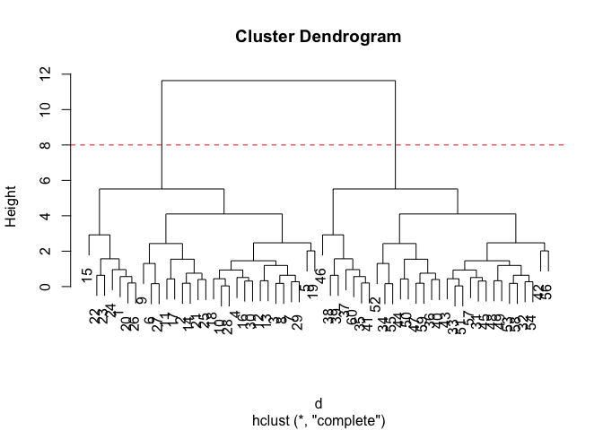

# Class 7: Machine Learning 1
Emma Bell(A19247017)

## Background

Today we will begin our exploration of some important machine learning
methods, namely **clusterring** and **dimensionality reduction**.

Let’s make up some input data for clustering where we know what the
natural “clusters” are.

The function `rnorm()` can be useful here.

``` r
rnorm(5)
```

    [1] -0.00427345  0.06573388  0.15008487  0.14922725 -0.68367053

``` r
hist( rnorm(5000))
```



``` r
hist( rnorm(5000, mean=10))
```



> Q. Generate 30 random numbers centered at +3 and -3.

``` r
rnorm(30, mean=3)
```

     [1] 1.489687 3.945375 3.875855 3.834556 2.774424 2.589828 3.188840 4.547448
     [9] 2.833313 2.492881 2.691657 4.057488 2.443167 1.589676 2.902560 3.204736
    [17] 2.684866 1.780357 3.766479 2.552848 3.215618 3.650407 3.675309 1.937543
    [25] 3.826017 2.437462 4.024066 5.058038 2.834005 4.630545

``` r
rnorm(30, mean=-3)
```

     [1] -2.540606 -2.121988 -1.300212 -1.812547 -1.638622 -0.665110 -3.679392
     [8] -3.108135 -2.568913 -3.526432 -3.471441 -2.725719 -2.319256 -3.844435
    [15] -2.942694 -5.215842 -2.405981 -1.880862 -3.093442 -3.265160 -4.002787
    [22] -3.478055 -2.733609 -5.609099 -3.783295 -3.494904 -3.401376 -4.508726
    [29] -2.965130 -3.333055

``` r
tmp <- c(rnorm(30, mean=3),
        rnorm(30, mean=-3))
tmp
```

     [1]  1.7300406  4.5438991  2.4424600  3.4949395  3.1701617  3.5005023
     [7]  3.0152593  2.5454677  3.0847508  3.2043101  4.7516367  2.2672573
    [13]  2.3468293  4.3615083 -0.6657153  3.2756075  4.4180007  3.4675782
    [19]  1.3767478  2.2508378  3.7893561  0.9049809  0.7491896  1.5403379
    [25]  4.1364621  2.1666743  3.4079370  3.2401698  2.7423535  2.9941165
    [31] -3.7734026 -2.6250682 -2.9736903 -2.1297154 -2.4542603 -2.8172000
    [37] -1.9965000 -2.1852676 -2.8023994 -3.0144039 -2.6394326 -4.1364135
    [43] -3.3454868 -2.0784750 -3.6371078 -2.8326632 -3.0236855 -3.2594104
    [49] -3.5798212 -1.8038058 -2.9902829 -1.0276386 -3.0806936 -2.6501984
    [55] -2.2634246 -5.0596429 -3.8745640 -2.9317736 -2.9716938 -2.8117553

(rev=reverse), (cbind= puts stuff in columns, rbind puts into rows)

``` r
x <-cbind(x=tmp, y=rev(tmp))
plot(x)
```



## K-means clustering

The main function in “base R” for K-means clustering is called
`kmeans()`

``` r
km <- kmeans(x, 2)
km
```

    K-means clustering with 2 clusters of sizes 30, 30

    Cluster means:
              x         y
    1  2.808455 -2.892329
    2 -2.892329  2.808455

    Clustering vector:
     [1] 1 1 1 1 1 1 1 1 1 1 1 1 1 1 1 1 1 1 1 1 1 1 1 1 1 1 1 1 1 1 2 2 2 2 2 2 2 2
    [39] 2 2 2 2 2 2 2 2 2 2 2 2 2 2 2 2 2 2 2 2 2 2

    Within cluster sum of squares by cluster:
    [1] 60.75544 60.75544
     (between_SS / total_SS =  88.9 %)

    Available components:

    [1] "cluster"      "centers"      "totss"        "withinss"     "tot.withinss"
    [6] "betweenss"    "size"         "iter"         "ifault"      

> Q. What component of the results object details the cluster sizes?
> size!

``` r
km$size
```

    [1] 30 30

> Q. What component of the results object details the cluster centres?

``` r
km$centers
```

              x         y
    1  2.808455 -2.892329
    2 -2.892329  2.808455

> Q. What component of the result objects details the cluster membership
> vector (ie our main result which points lie in which cluster)

``` r
km$cluster
```

     [1] 1 1 1 1 1 1 1 1 1 1 1 1 1 1 1 1 1 1 1 1 1 1 1 1 1 1 1 1 1 1 2 2 2 2 2 2 2 2
    [39] 2 2 2 2 2 2 2 2 2 2 2 2 2 2 2 2 2 2 2 2 2 2

> Q. Plout our clustering results with points coloured by cluster and
> also add the cluster centres as new points coloured blue

``` r
plot(x, col= km$cluster)
points(km$centers, col="blue", pch=15)
```



> Q. run `kmeans()` again and this time produce four clusters (and call
> your result object `k4`) and make a results figure like above

``` r
k4 <- kmeans(x, 4)
k4
```

    K-means clustering with 4 clusters of sizes 14, 11, 30, 5

    Cluster means:
              x         y
    1 -3.274080  3.427228
    2 -2.875427  1.555422
    3  2.808455 -2.892329
    4 -1.860612  3.832565

    Clustering vector:
     [1] 3 3 3 3 3 3 3 3 3 3 3 3 3 3 3 3 3 3 3 3 3 3 3 3 3 3 3 3 3 3 1 1 1 4 2 1 2 2
    [39] 2 1 2 2 1 4 1 2 1 2 2 4 1 4 1 1 4 1 1 2 1 2

    Within cluster sum of squares by cluster:
    [1]  9.921760 12.576282 60.755441  3.016439
     (between_SS / total_SS =  92.1 %)

    Available components:

    [1] "cluster"      "centers"      "totss"        "withinss"     "tot.withinss"
    [6] "betweenss"    "size"         "iter"         "ifault"      

``` r
plot(x, col=k4$cluster)
points(k4$centers, col="blue", pch=15)
```



The metric

``` r
km$tot.withinss
```

    [1] 121.5109

``` r
k4$tot.withinss
```

    [1] 86.26992

> Q. Let’s try different number of K (centers) from 1 to 30 and see what
> the best result is

``` r
ans <- NULL
for(i in 1:30){
ans <- c(ans, kmeans(x, centers= i)$tot.withinss)
}
ans
```

     [1] 1096.479191  121.510882   94.108091   66.705300   55.628644   51.679177
     [7]   48.302530   38.863773   31.749828   34.716233   26.268361   22.644469
    [13]   25.163878   22.893005   17.879110   16.384675   15.346368   11.552434
    [19]   11.825546   11.300244   10.601112    7.902569    7.720146    8.057761
    [25]    7.159664    8.735606    5.322386    4.696600    3.100286    4.793145

``` r
plot(ans, typ="o")
```



best result is 2- the ’elbow point, meaning the best number of clusters
is 2. **Key-Point**: K means will impose a clustering structure on your
data even if it is not there- it iwll always give you the answer you
asked for even if that answer is silly!

## Hierarchal Clustering

The main function for this is called `hclust()`.

Unlike `kmeans()` (which does all the work for you) you can’t just pass
`hclust()` our raw input data. It needs a “distance matrix” like the one
returned from the `dist()` function.

``` r
d <- dist(x)
dist(x)
```

                 1           2           3           4           5           6
    2   2.81840032                                                            
    3   0.72245814  2.10181833                                                
    4   2.06020152  1.38401265  1.41299919                                    
    5   2.66963431  2.49933707  2.24886133  1.22877684                        
    6   1.85342954  1.26107981  1.25145671  1.61114895  2.81566356            
    7   1.29533308  1.56208165  0.63826617  1.31497685  2.41441864  0.62052774
    8   0.85863218  2.00140179  0.18107389  1.23762949  2.07520669  1.25698827
    9   2.24015896  2.43073327  2.00954414  2.87632379  4.03290875  1.30384671
    10  1.48503963  1.33971803  0.76409356  0.93081596  2.06964164  0.78489032
    11  3.18527944  1.18621972  2.56994329  2.42225665  3.61960466  1.33288664
    12  0.93729770  2.35646278  0.67131330  1.26256752  1.73352491  1.80382728
    13  0.76211771  2.21582866  0.34130785  1.30252479  1.97957401  1.52412232
    14  2.63998803  0.18965642  1.92124813  1.21446932  2.35890418  1.14862007
    15  2.39584714  5.21146932  3.10975505  4.28912641  4.43546964  4.20492586
    16  1.75213699  1.43224978  1.09161863  0.32325208  1.42643777  1.39197097
    17  2.78618546  0.90204779  2.15194787  2.01940030  3.23178955  0.93595390
    18  1.81766506  1.13938054  1.10545284  0.52978420  1.73976652  1.08256295
    19  1.37096136  3.37452513  1.60838416  2.13431517  2.01709846  2.83168155
    20  0.54856619  2.31700836  0.34954586  1.75309393  2.58893298  1.30500698
    21  2.06926242  0.75575083  1.34942842  0.90915156  2.13691463  0.80461569
    22  0.82511269  3.64285415  1.54291265  2.80310936  3.19784181  2.65089130
    23  1.16385372  3.87534342  1.85052310  3.22379660  3.75807653  2.75242252
    24  0.83703541  3.15790802  1.29944639  2.71064410  3.46975067  1.97825505
    25  2.40642766  0.43574452  1.69787229  1.23675778  2.44177931  0.84327463
    26  0.56431522  2.43288626  0.55143155  1.94462104  2.79195370  1.34741060
    27  1.81121920  1.41397933  1.25516670  1.74701631  2.93955984  0.16262373
    28  1.51878671  1.30373092  0.79881032  0.93620560  2.08712699  0.75647233
    29  1.02938308  1.83458880  0.42895732  1.45863821  2.47187658  0.83998547
    30  1.58828635  1.74486768  1.00631223  0.51093760  1.29823182  1.59262678
    31  7.99975216 10.23564367  8.58796376 10.00037840 10.63372587  8.97504489
    32  7.05798106  9.16757485  7.60759882  9.01321751  9.71883925  7.91077919
    33  7.66491235  9.75199468  8.21142918  9.61574788 10.32636468  8.49733609
    34  7.31999242  9.23237892  7.81643901  9.20171523  9.98942475  7.99147632
    35  6.50331721  8.68199641  7.06909047  8.47876978  9.15717107  7.42192515
    36  8.30392208 10.23287159  8.81044716 10.19900207 10.97346102  8.99288117
    37  5.72955671  7.94576940  6.30112270  7.71213782  8.38177425  6.68473211
    38  5.29244430  7.68938607  5.91315081  7.32419614  7.90083272  6.43458025
    39  5.86149640  8.30642575  6.49840249  7.90572740  8.44086624  7.05445693
    40  8.12923277 10.14099308  8.65742157 10.05520870 10.79600087  8.89270245
    41  6.68746179  8.88116500  7.25844981  8.66897156  9.33780029  7.62085072
    42  7.20824811  9.70859263  7.86415488  9.26357502  9.73720520  8.46010263
    43  8.07409483 10.18364543  8.62855906 10.03486337 10.73159702  8.92815543
    44  8.17154591  9.92287377  8.62890696  9.99147523 10.83392424  8.70439149
    45  8.11555719 10.29357320  8.68865499 10.09906190 10.76175255  9.03473049
    46  5.04219731  7.72859686  5.74124943  7.09473506  7.43912002  6.53158941
    47  8.60544146 10.53775074  9.11431335 10.50358787 11.27483184  9.29810531
    48  7.17674133  9.44342774  7.77013348  9.18297207  9.80791657  8.18235052
    49  7.34785689  9.66651128  7.95599099  9.36878896  9.96221537  8.40583478
    50  8.34823146  9.99715918  8.77869961 10.12363763 11.00007086  8.79470118
    51  7.64686191  9.74201847  8.19549992  9.60044622 10.30747286  8.48683777
    52  6.50949916  8.22937147  6.94551301  8.29974549  9.16256932  7.00764159
    53  7.20020846  9.41134877  7.77852158  9.18998133  9.84433335  8.15092536
    54  7.28975943  9.35941487  7.82958299  9.23213864  9.95392569  8.10528361
    55  7.46942834  9.39302819  7.96991360  9.35683486 10.13903076  8.15142356
    56  9.04892991 11.39957930  9.67032376 11.08192396 11.63870125 10.13903076
    57  8.43717909 10.61545415  9.01151666 10.42205169 11.08192396  9.35683486
    58  7.02419317  9.23031659  7.60031403  9.01151666  9.67032376  7.96991360
    59  8.72994608 10.62865346  9.23031659 10.61545415 11.39957930  9.39302819
    60  6.42306934  8.72994608  7.02419317  8.43717909  9.04892991  7.46942834
                 7           8           9          10          11          12
    2                                                                         
    3                                                                         
    4                                                                         
    5                                                                         
    6                                                                         
    7                                                                         
    8   0.63720502                                                            
    9   1.62404718  2.12270132                                                
    10  0.38909858  0.66501680  1.96628256                                    
    11  1.93167979  2.54904371  1.83873431  1.94985834                        
    12  1.19319128  0.57142746  2.67991254  1.10707867  3.05391081            
    13  0.90439918  0.26720199  2.35060274  0.89872289  2.81102882  0.33014356
    14  1.39709664  1.81693515  2.36945411  1.15768020  1.28074457  2.16683502
    15  3.68549422  3.22074768  4.16222420  3.87323388  5.51418628  3.02664394
    16  1.02067206  0.91798745  2.61643952  0.65074247  2.35364787  1.00997620
    17  1.51477754  2.12386952  1.69759012  1.51803772  0.43215293  2.62292530
    18  0.82946872  0.95937645  2.34925028  0.44213106  2.00638642  1.22298110
    19  2.21213818  1.57494470  3.54707703  2.15722026  4.10255210  1.05014395
    20  0.76449729  0.53058272  1.81474262  1.01597506  2.63671521  0.94053186
    21  0.85549491  1.24565352  2.10800967  0.58554307  1.54645775  1.62372456
    22  2.11575989  1.66392445  2.81090243  2.30699259  3.97416022  1.56849661
    23  2.31327311  2.00708814  2.60671267  2.58373108  4.02058398  2.06138528
    24  1.61329312  1.47843216  1.82315763  1.93814550  3.21707490  1.74221630
    25  1.13357189  1.61266609  2.07572312  0.94808493  1.18549889  2.01879107
    26  0.87091234  0.73205408  1.69650048  1.16790770  2.66554341  1.13004612
    27  0.65199568  1.28382743  1.14848704  0.88433051  1.38265894  1.84498155
    28  0.39399460  0.70289445  1.95224799  0.03951241  1.91132468  1.14627796
    29  0.27406041  0.49634518  1.63371265  0.58888517  2.17064294  1.06642845
    30  1.12340320  0.82530693  2.74725943  0.81083769  2.63973269  0.75219550
    31  8.82860246  8.76535454  7.95039517  9.19247037  9.78245130  8.92783451
    32  7.80339091  7.78731781  6.84213955  8.17586517  8.66506425  7.99404409
    33  8.40023539  8.39132999  7.41072856  8.77417974  9.22617834  8.60115157
    34  7.94806703  7.99747864  6.84580088  8.33000882  8.63222276  8.25603620
    35  7.28820325  7.24790656  6.39408157  7.65595365  8.22737278  7.43740130
    36  8.94853854  8.99141487  7.84225479  9.33000958  9.62154205  9.24081887
    37  6.53286506  6.47946009  5.69329552  6.89745976  7.53131104  6.66300649
    38  6.21299594  6.08669547  5.56149374  6.55981726  7.39178098  6.21009760
    39  6.81795074  6.66972891  6.19625337  7.15916470  8.02502249  6.76866816
    40  8.82183090  8.83797236  7.77194486  9.19977769  9.57051965  9.06646121
    41  7.48302724  7.43696301  6.59656609  7.84975642  8.43018625  7.62051116
    42  8.20747943  8.03220514  7.61093212  8.54149749  9.43998708  8.09781297
    43  8.82532046  8.80813309  7.84569502  9.19803293  9.66182683  9.00936924
    44  8.71238011  8.80972542  7.50425804  9.09892766  9.23911800  9.10222739
    45  8.90893733  8.86717568  7.98131015  9.27719693  9.80670558  9.04756489
    46  6.17546525  5.89545695  5.92847180  6.46905416  7.66921477  5.87377243
    47  9.25380383  9.29525884  8.14591306  9.63518365  9.92304053  9.54247294
    48  8.02133190  7.94698777  7.18577869  8.38238925  9.02245236  8.10365607
    49  8.22657018  8.13140473  7.43457189  8.58289965  9.27290378  8.26901769
    50  8.83235817  8.95888261  7.56954484  9.22055010  9.27079566  9.27290378
    51  8.38700228  8.37530935  7.40374402  8.76047749  9.22055010  8.58289965
    52  7.01674186  7.12599425  5.81579697  7.40374402  7.56954484  7.43457189
    53  8.00971835  7.95659363  7.12599425  8.37530935  8.95888261  8.13140473
    54  8.01216710  8.00971835  7.01674186  8.38700228  8.83235817  8.22657018
    55  8.10528361  8.15092536  7.00764159  8.48683777  8.79470118  8.40583478
    56  9.95392569  9.84433335  9.16256932 10.30747286 11.00007086  9.96221537
    57  9.23213864  9.18998133  8.29974549  9.60044622 10.12363763  9.36878896
    58  7.82958299  7.77852158  6.94551301  8.19549992  8.77869961  7.95599099
    59  9.35941487  9.41134877  8.22937147  9.74201847  9.99715918  9.66651128
    60  7.28975943  7.20020846  6.50949916  7.64686191  8.34823146  7.34785689
                13          14          15          16          17          18
    2                                                                         
    3                                                                         
    4                                                                         
    5                                                                         
    6                                                                         
    7                                                                         
    8                                                                         
    9                                                                         
    10                                                                        
    11                                                                        
    12                                                                        
    13                                                                        
    14  2.02842245                                                            
    15  3.04262031  5.03085152                                                
    16  1.00263870  1.24718379  4.02258090                                    
    17  2.38418940  0.94689719  5.13935485  1.93245914                        
    18  1.12404946  0.95008795  4.16498539  0.34913544  1.58386292            
    19  1.30774335  3.18542918  2.42310133  1.96340893  3.67210158  2.23542768
    20  0.62736494  2.14536249  2.92294720  1.43021285  2.23858623  1.40675856
    21  1.46318549  0.57222746  4.45877689  0.80727803  1.12745590  0.46168922
    22  1.51254284  3.46360348  1.57098779  2.51328645  3.58683345  2.61951307
    23  1.92515853  3.70834073  1.55598109  2.91386816  3.67036500  2.95562940
    24  1.49845619  3.00235117  2.35920320  2.38804412  2.87883014  2.35244989
    25  1.84345746  0.30542113  4.80220230  1.18883109  0.79055589  0.85234533
    26  0.82505910  2.26749676  2.85755483  1.62137637  2.28247347  1.57690702
    27  1.54989043  1.30708865  4.13385768  1.51318970  1.01136250  1.21723342
    28  0.93791954  1.12245252  3.90843024  0.66436332  1.47942426  0.43582934
    29  0.74754894  1.66750056  3.41438557  1.14393364  1.76254292  1.02222986
    30  0.82654022  1.55943452  3.77880400  0.31275144  2.21364533  0.63818329
    31  8.75007643 10.11882983  6.60371734  9.67789650  9.63484679  9.62405181
    32  7.79364703  9.05866748  5.90930411  8.68996551  8.53494031  8.61290537
    33  8.39955184  9.64577742  6.49661829  9.29250617  9.10632077  9.21199286
    34  8.03075178  9.13792941  6.41002247  8.87976201  8.54244127  8.77145536
    35  7.24519536  8.56706111  5.30963922  8.15568954  8.07770159  8.09024663
    36  9.02031753 10.13911076  7.29366809  9.87677545  9.53800672  9.77128427
    37  6.47318262  7.82653050  4.57100939  7.38925318  7.36489145  7.32989998
    38  6.05051866  7.55611416  3.89084938  7.00433882  7.18323317  6.98004586
    39  6.62243995  8.17043409  4.30527614  7.58767015  7.81250191  7.57489898
    40  8.85595453 10.04099682  7.02619943  9.73224592  9.46953430  9.63960971
    41  7.43139578  8.76548746  5.45321401  8.34599330  8.27951172  8.28338279
    42  7.97034498  9.56966496  5.45572053  8.94856431  9.22586395  8.95098812
    43  8.81219825 10.07642189  6.84647481  9.71161438  9.54098757  9.63512892
    44  8.86148739  9.84134536  7.38701680  9.67217520  9.18740402  9.54098757
    45  8.86081051 10.18130410  6.79265378  9.77605584  9.67217520  9.71161438
    46  5.79261575  7.57074156  3.06452713  6.79265378  7.38701680  6.84647481
    47  9.32313419 10.44424127  7.57074156 10.18130410  9.84134536 10.07642189
    48  7.92842021  9.32313419  5.79261575  8.86081051  8.86148739  8.81219825
    49  8.10365607  9.54247294  5.87377243  9.04756489  9.10222739  9.00936924
    50  9.02245236  9.92304053  7.66921477  9.80670558  9.23911800  9.66182683
    51  8.38238925  9.63518365  6.46905416  9.27719693  9.09892766  9.19803293
    52  7.18577869  8.14591306  5.92847180  7.98131015  7.50425804  7.84569502
    53  7.94698777  9.29525884  5.89545695  8.86717568  8.80972542  8.80813309
    54  8.02133190  9.25380383  6.17546525  8.90893733  8.71238011  8.82532046
    55  8.18235052  9.29810531  6.53158941  9.03473049  8.70439149  8.92815543
    56  9.80791657 11.27483184  7.43912002 10.76175255 10.83392424 10.73159702
    57  9.18297207 10.50358787  7.09473506 10.09906190  9.99147523 10.03486337
    58  7.77013348  9.11431335  5.74124943  8.68865499  8.62890696  8.62855906
    59  9.44342774 10.53775074  7.72859686 10.29357320  9.92287377 10.18364543
    60  7.17674133  8.60544146  5.04219731  8.11555719  8.17154591  8.07409483
                19          20          21          22          23          24
    2                                                                         
    3                                                                         
    4                                                                         
    5                                                                         
    6                                                                         
    7                                                                         
    8                                                                         
    9                                                                         
    10                                                                        
    11                                                                        
    12                                                                        
    13                                                                        
    14                                                                        
    15                                                                        
    16                                                                        
    17                                                                        
    18                                                                        
    19                                                                        
    20  1.73348927                                                            
    21  2.66074889  1.58355361                                                
    22  1.41497617  1.35568762  2.89215598                                    
    23  2.04958520  1.56882543  3.15120286  0.63649241                        
    24  2.14615732  0.95821316  2.46864564  1.02623205  0.81335649            
    25  3.05881468  1.89398525  0.39921411  3.23151504  3.44571522  2.72275766
    26  1.85839265  0.20340182  1.71664128  1.30884335  1.44278197  0.77578457
    27  2.85527006  1.26439325  0.96340763  2.59177411  2.65932772  1.87234423
    28  2.19642133  1.04427290  0.55069344  2.34146267  2.61277487  1.96069611
    29  2.03692014  0.49172553  1.11704827  1.84591015  2.04110921  1.35644365
    30  1.65760629  1.35585809  1.09931120  2.30376536  2.74988540  2.29583429
    31  8.79593694  8.24792997  9.65907020  7.44895086  6.87603520  7.28986226
    32  7.95813831  7.26209893  8.61888011  6.57309142  5.97219096  6.30930585
    33  8.56389464  7.86545730  9.21186674  7.18030169  6.57990921  6.91369375
    34  8.31940553  7.46725695  8.73394931  6.91213860  6.29063048  6.53278127
    35  7.37601095  6.72581680  8.11334189  5.99801586  5.40384021  5.76964772
    36  9.27521793  8.46154576  9.73557745  7.87416213  7.25833320  7.52338760
    37  6.60335570  5.95905700  7.36354562  5.22283052  4.62806090  5.00184416
    38  6.04624434  5.58227478  7.06121550  4.70780417  4.14994915  4.62806090
    39  6.54835308  6.17236369  7.66895154  5.24302749  4.70780417  5.22283052
    40  9.06090704  8.30975902  9.62196969  7.66895154  7.06121550  7.36354562
    41  7.54497739  6.91588679  8.30975902  6.17236369  5.58227478  5.95905700
    42  7.79678736  7.54497739  9.06090704  6.54835308  6.04624434  6.60335570
    43  8.95098812  8.28338279  9.63960971  7.57489898  6.98004586  7.32989998
    44  9.22586395  8.27951172  9.46953430  7.81250191  7.18323317  7.36489145
    45  8.94856431  8.34599330  9.73224592  7.58767015  7.00433882  7.38925318
    46  5.45572053  5.45321401  7.02619943  4.30527614  3.89084938  4.57100939
    47  9.56966496  8.76548746 10.04099682  8.17043409  7.55611416  7.82653050
    48  7.97034498  7.43139578  8.85595453  6.62243995  6.05051866  6.47318262
    49  8.09781297  7.62051116  9.06646121  6.76866816  6.21009760  6.66300649
    50  9.43998708  8.43018625  9.57051965  8.02502249  7.39178098  7.53131104
    51  8.54149749  7.84975642  9.19977769  7.15916470  6.55981726  6.89745976
    52  7.61093212  6.59656609  7.77194486  6.19625337  5.56149374  5.69329552
    53  8.03220514  7.43696301  8.83797236  6.66972891  6.08669547  6.47946009
    54  8.20747943  7.48302724  8.82183090  6.81795074  6.21299594  6.53286506
    55  8.46010263  7.62085072  8.89270245  7.05445693  6.43458025  6.68473211
    56  9.73720520  9.33780029 10.79600087  8.44086624  7.90083272  8.38177425
    57  9.26357502  8.66897156 10.05520870  7.90572740  7.32419614  7.71213782
    58  7.86415488  7.25844981  8.65742157  6.49840249  5.91315081  6.30112270
    59  9.70859263  8.88116500 10.14099308  8.30642575  7.68938607  7.94576940
    60  7.20824811  6.68746179  8.12923277  5.86149640  5.29244430  5.72955671
                25          26          27          28          29          30
    2                                                                         
    3                                                                         
    4                                                                         
    5                                                                         
    6                                                                         
    7                                                                         
    8                                                                         
    9                                                                         
    10                                                                        
    11                                                                        
    12                                                                        
    13                                                                        
    14                                                                        
    15                                                                        
    16                                                                        
    17                                                                        
    18                                                                        
    19                                                                        
    20                                                                        
    21                                                                        
    22                                                                        
    23                                                                        
    24                                                                        
    25                                                                        
    26  2.00294515                                                            
    27  1.00169050  1.28298974                                                
    28  0.90985117  1.19256033  0.86048798                                    
    29  1.40728583  0.60048472  0.82968418  0.60774867                        
    30  1.48972373  1.55717603  1.69497939  0.83670899  1.17560905            
    31  9.81515967  8.06035502  8.82186447  9.20895846  8.60408706  9.57071734
    32  8.75368074  7.06863425  7.75462487  8.18988234  7.59068049  8.60408706
    33  9.34055651  7.67136765  8.34031381  8.78772521  8.18988234  9.20895846
    34  8.83274089  7.26803423  7.83142317  8.34031381  7.75462487  8.82186447
    35  8.26296703  6.53498831  7.26803423  7.67136765  7.06863425  8.06035502
    36  9.83396325  8.26296703  8.83274089  9.34055651  8.75368074  9.81515967
    37  7.52338760  5.76964772  6.53278127  6.91369375  6.30930585  7.28986226
    38  7.25833320  5.40384021  6.29063048  6.57990921  5.97219096  6.87603520
    39  7.87416213  5.99801586  6.91213860  7.18030169  6.57309142  7.44895086
    40  9.73557745  8.11334189  8.73394931  9.21186674  8.61888011  9.65907020
    41  8.46154576  6.72581680  7.46725695  7.86545730  7.26209893  8.24792997
    42  9.27521793  7.37601095  8.31940553  8.56389464  7.95813831  8.79593694
    43  9.77128427  8.09024663  8.77145536  9.21199286  8.61290537  9.62405181
    44  9.53800672  8.07770159  8.54244127  9.10632077  8.53494031  9.63484679
    45  9.87677545  8.15568954  8.87976201  9.29250617  8.68996551  9.67789650
    46  7.29366809  5.30963922  6.41002247  6.49661829  5.90930411  6.60371734
    47 10.13911076  8.56706111  9.13792941  9.64577742  9.05866748 10.11882983
    48  9.02031753  7.24519536  8.03075178  8.39955184  7.79364703  8.75007643
    49  9.24081887  7.43740130  8.25603620  8.60115157  7.99404409  8.92783451
    50  9.62154205  8.22737278  8.63222276  9.22617834  8.66506425  9.78245130
    51  9.33000958  7.65595365  8.33000882  8.77417974  8.17586517  9.19247037
    52  7.84225479  6.39408157  6.84580088  7.41072856  6.84213955  7.95039517
    53  8.99141487  7.24790656  7.99747864  8.39132999  7.78731781  8.76535454
    54  8.94853854  7.28820325  7.94806703  8.40023539  7.80339091  8.82860246
    55  8.99288117  7.42192515  7.99147632  8.49733609  7.91077919  8.97504489
    56 10.97346102  9.15717107  9.98942475 10.32636468  9.71883925 10.63372587
    57 10.19900207  8.47876978  9.20171523  9.61574788  9.01321751 10.00037840
    58  8.81044716  7.06909047  7.81643901  8.21142918  7.60759882  8.58796376
    59 10.23287159  8.68199641  9.23237892  9.75199468  9.16757485 10.23564367
    60  8.30392208  6.50331721  7.31999242  7.66491235  7.05798106  7.99975216
                31          32          33          34          35          36
    2                                                                         
    3                                                                         
    4                                                                         
    5                                                                         
    6                                                                         
    7                                                                         
    8                                                                         
    9                                                                         
    10                                                                        
    11                                                                        
    12                                                                        
    13                                                                        
    14                                                                        
    15                                                                        
    16                                                                        
    17                                                                        
    18                                                                        
    19                                                                        
    20                                                                        
    21                                                                        
    22                                                                        
    23                                                                        
    24                                                                        
    25                                                                        
    26                                                                        
    27                                                                        
    28                                                                        
    29                                                                        
    30                                                                        
    31                                                                        
    32  1.17560905                                                            
    33  0.83670899  0.60774867                                                
    34  1.69497939  0.82968418  0.86048798                                    
    35  1.55717603  0.60048472  1.19256033  1.28298974                        
    36  1.48972373  1.40728583  0.90985117  1.00169050  2.00294515            
    37  2.29583429  1.35644365  1.96069611  1.87234423  0.77578457  2.72275766
    38  2.74988540  2.04110921  2.61277487  2.65932772  1.44278197  3.44571522
    39  2.30376536  1.84591015  2.34146267  2.59177411  1.30884335  3.23151504
    40  1.09931120  1.11704827  0.55069344  0.96340763  1.71664128  0.39921411
    41  1.35585809  0.49172553  1.04427290  1.26439325  0.20340182  1.89398525
    42  1.65760629  2.03692014  2.19642133  2.85527006  1.85839265  3.05881468
    43  0.63818329  1.02222986  0.43582934  1.21723342  1.57690702  0.85234533
    44  2.21364533  1.76254292  1.47942426  1.01136250  2.28247347  0.79055589
    45  0.31275144  1.14393364  0.66436332  1.51318970  1.62137637  1.18883109
    46  3.77880400  3.41438557  3.90843024  4.13385768  2.85755483  4.80220230
    47  1.55943452  1.66750056  1.12245252  1.30708865  2.26749676  0.30542113
    48  0.82654022  0.74754894  0.93791954  1.54989043  0.82505910  1.84345746
    49  0.75219550  1.06642845  1.14627796  1.84498155  1.13004612  2.01879107
    50  2.63973269  2.17064294  1.91132468  1.38265894  2.66554341  1.18549889
    51  0.81083769  0.58888517  0.03951241  0.88433051  1.16790770  0.94808493
    52  2.74725943  1.63371265  1.95224799  1.14848704  1.69650048  2.07572312
    53  0.82530693  0.49634518  0.70289445  1.28382743  0.73205408  1.61266609
    54  1.12340320  0.27406041  0.39399460  0.65199568  0.87091234  1.13357189
    55  1.59262678  0.83998547  0.75647233  0.16262373  1.34741060  0.84327463
    56  1.29823182  2.47187658  2.08712699  2.93955984  2.79195370  2.44177931
    57  0.51093760  1.45863821  0.93620560  1.74701631  1.94462104  1.23675778
    58  1.00631223  0.42895732  0.79881032  1.25516670  0.55143155  1.69787229
    59  1.74486768  1.83458880  1.30373092  1.41397933  2.43288626  0.43574452
    60  1.58828635  1.02938308  1.51878671  1.81121920  0.56431522  2.40642766
                37          38          39          40          41          42
    2                                                                         
    3                                                                         
    4                                                                         
    5                                                                         
    6                                                                         
    7                                                                         
    8                                                                         
    9                                                                         
    10                                                                        
    11                                                                        
    12                                                                        
    13                                                                        
    14                                                                        
    15                                                                        
    16                                                                        
    17                                                                        
    18                                                                        
    19                                                                        
    20                                                                        
    21                                                                        
    22                                                                        
    23                                                                        
    24                                                                        
    25                                                                        
    26                                                                        
    27                                                                        
    28                                                                        
    29                                                                        
    30                                                                        
    31                                                                        
    32                                                                        
    33                                                                        
    34                                                                        
    35                                                                        
    36                                                                        
    37                                                                        
    38  0.81335649                                                            
    39  1.02623205  0.63649241                                                
    40  2.46864564  3.15120286  2.89215598                                    
    41  0.95821316  1.56882543  1.35568762  1.58355361                        
    42  2.14615732  2.04958520  1.41497617  2.66074889  1.73348927            
    43  2.35244989  2.95562940  2.61951307  0.46168922  1.40675856  2.23542768
    44  2.87883014  3.67036500  3.58683345  1.12745590  2.23858623  3.67210158
    45  2.38804412  2.91386816  2.51328645  0.80727803  1.43021285  1.96340893
    46  2.35920320  1.55598109  1.57098779  4.45877689  2.92294720  2.42310133
    47  3.00235117  3.70834073  3.46360348  0.57222746  2.14536249  3.18542918
    48  1.49845619  1.92515853  1.51254284  1.46318549  0.62736494  1.30774335
    49  1.74221630  2.06138528  1.56849661  1.62372456  0.94053186  1.05014395
    50  3.21707490  4.02058398  3.97416022  1.54645775  2.63671521  4.10255210
    51  1.93814550  2.58373108  2.30699259  0.58554307  1.01597506  2.15722026
    52  1.82315763  2.60671267  2.81090243  2.10800967  1.81474262  3.54707703
    53  1.47843216  2.00708814  1.66392445  1.24565352  0.53058272  1.57494470
    54  1.61329312  2.31327311  2.11575989  0.85549491  0.76449729  2.21213818
    55  1.97825505  2.75242252  2.65089130  0.80461569  1.30500698  2.83168155
    56  3.46975067  3.75807653  3.19784181  2.13691463  2.58893298  2.01709846
    57  2.71064410  3.22379660  2.80310936  0.90915156  1.75309393  2.13431517
    58  1.29944639  1.85052310  1.54291265  1.34942842  0.34954586  1.60838416
    59  3.15790802  3.87534342  3.64285415  0.75575083  2.31700836  3.37452513
    60  0.83703541  1.16385372  0.82511269  2.06926242  0.54856619  1.37096136
                43          44          45          46          47          48
    2                                                                         
    3                                                                         
    4                                                                         
    5                                                                         
    6                                                                         
    7                                                                         
    8                                                                         
    9                                                                         
    10                                                                        
    11                                                                        
    12                                                                        
    13                                                                        
    14                                                                        
    15                                                                        
    16                                                                        
    17                                                                        
    18                                                                        
    19                                                                        
    20                                                                        
    21                                                                        
    22                                                                        
    23                                                                        
    24                                                                        
    25                                                                        
    26                                                                        
    27                                                                        
    28                                                                        
    29                                                                        
    30                                                                        
    31                                                                        
    32                                                                        
    33                                                                        
    34                                                                        
    35                                                                        
    36                                                                        
    37                                                                        
    38                                                                        
    39                                                                        
    40                                                                        
    41                                                                        
    42                                                                        
    43                                                                        
    44  1.58386292                                                            
    45  0.34913544  1.93245914                                                
    46  4.16498539  5.13935485  4.02258090                                    
    47  0.95008795  0.94689719  1.24718379  5.03085152                        
    48  1.12404946  2.38418940  1.00263870  3.04262031  2.02842245            
    49  1.22298110  2.62292530  1.00997620  3.02664394  2.16683502  0.33014356
    50  2.00638642  0.43215293  2.35364787  5.51418628  1.28074457  2.81102882
    51  0.44213106  1.51803772  0.65074247  3.87323388  1.15768020  0.89872289
    52  2.34925028  1.69759012  2.61643952  4.16222420  2.36945411  2.35060274
    53  0.95937645  2.12386952  0.91798745  3.22074768  1.81693515  0.26720199
    54  0.82946872  1.51477754  1.02067206  3.68549422  1.39709664  0.90439918
    55  1.08256295  0.93595390  1.39197097  4.20492586  1.14862007  1.52412232
    56  1.73976652  3.23178955  1.42643777  4.43546964  2.35890418  1.97957401
    57  0.52978420  2.01940030  0.32325208  4.28912641  1.21446932  1.30252479
    58  1.10545284  2.15194787  1.09161863  3.10975505  1.92124813  0.34130785
    59  1.13938054  0.90204779  1.43224978  5.21146932  0.18965642  2.21582866
    60  1.81766506  2.78618546  1.75213699  2.39584714  2.63998803  0.76211771
                49          50          51          52          53          54
    2                                                                         
    3                                                                         
    4                                                                         
    5                                                                         
    6                                                                         
    7                                                                         
    8                                                                         
    9                                                                         
    10                                                                        
    11                                                                        
    12                                                                        
    13                                                                        
    14                                                                        
    15                                                                        
    16                                                                        
    17                                                                        
    18                                                                        
    19                                                                        
    20                                                                        
    21                                                                        
    22                                                                        
    23                                                                        
    24                                                                        
    25                                                                        
    26                                                                        
    27                                                                        
    28                                                                        
    29                                                                        
    30                                                                        
    31                                                                        
    32                                                                        
    33                                                                        
    34                                                                        
    35                                                                        
    36                                                                        
    37                                                                        
    38                                                                        
    39                                                                        
    40                                                                        
    41                                                                        
    42                                                                        
    43                                                                        
    44                                                                        
    45                                                                        
    46                                                                        
    47                                                                        
    48                                                                        
    49                                                                        
    50  3.05391081                                                            
    51  1.10707867  1.94985834                                                
    52  2.67991254  1.83873431  1.96628256                                    
    53  0.57142746  2.54904371  0.66501680  2.12270132                        
    54  1.19319128  1.93167979  0.38909858  1.62404718  0.63720502            
    55  1.80382728  1.33288664  0.78489032  1.30384671  1.25698827  0.62052774
    56  1.73352491  3.61960466  2.06964164  4.03290875  2.07520669  2.41441864
    57  1.26256752  2.42225665  0.93081596  2.87632379  1.23762949  1.31497685
    58  0.67131330  2.56994329  0.76409356  2.00954414  0.18107389  0.63826617
    59  2.35646278  1.18621972  1.33971803  2.43073327  2.00140179  1.56208165
    60  0.93729770  3.18527944  1.48503963  2.24015896  0.85863218  1.29533308
                55          56          57          58          59
    2                                                             
    3                                                             
    4                                                             
    5                                                             
    6                                                             
    7                                                             
    8                                                             
    9                                                             
    10                                                            
    11                                                            
    12                                                            
    13                                                            
    14                                                            
    15                                                            
    16                                                            
    17                                                            
    18                                                            
    19                                                            
    20                                                            
    21                                                            
    22                                                            
    23                                                            
    24                                                            
    25                                                            
    26                                                            
    27                                                            
    28                                                            
    29                                                            
    30                                                            
    31                                                            
    32                                                            
    33                                                            
    34                                                            
    35                                                            
    36                                                            
    37                                                            
    38                                                            
    39                                                            
    40                                                            
    41                                                            
    42                                                            
    43                                                            
    44                                                            
    45                                                            
    46                                                            
    47                                                            
    48                                                            
    49                                                            
    50                                                            
    51                                                            
    52                                                            
    53                                                            
    54                                                            
    55                                                            
    56  2.81566356                                                
    57  1.61114895  1.22877684                                    
    58  1.25145671  2.24886133  1.41299919                        
    59  1.26107981  2.49933707  1.38401265  2.10181833            
    60  1.85342954  2.66963431  2.06020152  0.72245814  2.81840032

ie distance between point 1 and 2 is x, distance between point 1 and 3
is y etc.

``` r
hc <- hclust(d)
hc
```


    Call:
    hclust(d = d)

    Cluster method   : complete 
    Distance         : euclidean 
    Number of objects: 60 

``` r
plot(hc)
```



To extract our cluster membership vector from a `hclust()` result object
we have to “cut” our tree at a given height to yield separate
“groups/branches”.

``` r
plot(hc)
abline(h=8, col="red", lty=2)
```



to do this we use the `cutree()` function on our `hclust()` object:

``` r
grps <- cutree(hc, h=8)
grps
```

     [1] 1 1 1 1 1 1 1 1 1 1 1 1 1 1 1 1 1 1 1 1 1 1 1 1 1 1 1 1 1 1 2 2 2 2 2 2 2 2
    [39] 2 2 2 2 2 2 2 2 2 2 2 2 2 2 2 2 2 2 2 2 2 2

``` r
table(grps, km$cluster)
```

        
    grps  1  2
       1 30  0
       2  0 30

## PCA of UK food data

Import the dataset of food consumption in the UK

``` r
url <- "https://tinyurl.com/UK-foods"
x <- read.csv(url)
x
```

                         X England Wales Scotland N.Ireland
    1               Cheese     105   103      103        66
    2        Carcass_meat      245   227      242       267
    3          Other_meat      685   803      750       586
    4                 Fish     147   160      122        93
    5       Fats_and_oils      193   235      184       209
    6               Sugars     156   175      147       139
    7      Fresh_potatoes      720   874      566      1033
    8           Fresh_Veg      253   265      171       143
    9           Other_Veg      488   570      418       355
    10 Processed_potatoes      198   203      220       187
    11      Processed_Veg      360   365      337       334
    12        Fresh_fruit     1102  1137      957       674
    13            Cereals     1472  1582     1462      1494
    14           Beverages      57    73       53        47
    15        Soft_drinks     1374  1256     1572      1506
    16   Alcoholic_drinks      375   475      458       135
    17      Confectionery       54    64       62        41

> 17. 

``` r
dim(x)
```

    [1] 17  5

One solution is to set the row names is to do it by hands..

``` r
rownames(x) <- x[,1]
x[,1]
```

     [1] "Cheese"              "Carcass_meat "       "Other_meat "        
     [4] "Fish"                "Fats_and_oils "      "Sugars"             
     [7] "Fresh_potatoes "     "Fresh_Veg "          "Other_Veg "         
    [10] "Processed_potatoes " "Processed_Veg "      "Fresh_fruit "       
    [13] "Cereals "            "Beverages"           "Soft_drinks "       
    [16] "Alcoholic_drinks "   "Confectionery "     

(computer went wierd and had to find the script.. thats why I might miss
some annotations)

``` r
x <- read.csv(url, row.names=1)
x
```

                        England Wales Scotland N.Ireland
    Cheese                  105   103      103        66
    Carcass_meat            245   227      242       267
    Other_meat              685   803      750       586
    Fish                    147   160      122        93
    Fats_and_oils           193   235      184       209
    Sugars                  156   175      147       139
    Fresh_potatoes          720   874      566      1033
    Fresh_Veg               253   265      171       143
    Other_Veg               488   570      418       355
    Processed_potatoes      198   203      220       187
    Processed_Veg           360   365      337       334
    Fresh_fruit            1102  1137      957       674
    Cereals                1472  1582     1462      1494
    Beverages                57    73       53        47
    Soft_drinks            1374  1256     1572      1506
    Alcoholic_drinks        375   475      458       135
    Confectionery            54    64       62        41

## Spotting major differences and trends

Is diffuclt even in this wee 17D dataset…

``` r
barplot(as.matrix(x), beside=T, col=rainbow(nrow(x)))
```


## Pairs plot

``` r
pairs(x, col=rainbow(10), pch=16)
```


Pheatmap- hotter is there is more stuff, colder means less

``` r
library(pheatmap)
pheatmap(as.matrix(x))
```


## PCA to the rescue

The main PCA function in “base R” is called `prcomp()`. This function
wants the transpose of our food data as input (ie the food as columsn
and the countries as rows).

``` r
pca <- prcomp(t(x))
pca
```

    Standard deviations (1, .., p=4):
    [1] 3.241502e+02 2.127478e+02 7.387622e+01 2.699876e-14

    Rotation (n x k) = (17 x 4):
                                 PC1          PC2         PC3          PC4
    Cheese              -0.056955380  0.016012850  0.02394295  0.739145824
    Carcass_meat         0.047927628  0.013915823  0.06367111  0.578851042
    Other_meat          -0.258916658 -0.015331138 -0.55384854 -0.084756407
    Fish                -0.084414983 -0.050754947  0.03906481  0.001282376
    Fats_and_oils       -0.005193623 -0.095388656 -0.12522257  0.012073959
    Sugars              -0.037620983 -0.043021699 -0.03605745  0.011712878
    Fresh_potatoes       0.401402060 -0.715017078 -0.20668248  0.098706764
    Fresh_Veg           -0.151849942 -0.144900268  0.21382237  0.067864113
    Other_Veg           -0.243593729 -0.225450923 -0.05332841  0.017187324
    Processed_potatoes  -0.026886233  0.042850761 -0.07364902  0.020275689
    Processed_Veg       -0.036488269 -0.045451802  0.05289191 -0.013653986
    Fresh_fruit         -0.632640898 -0.177740743  0.40012865  0.088466607
    Cereals             -0.047702858 -0.212599678 -0.35884921  0.201601167
    Beverages           -0.026187756 -0.030560542 -0.04135860 -0.004452115
    Soft_drinks          0.232244140  0.555124311 -0.16942648  0.212426744
    Alcoholic_drinks    -0.463968168  0.113536523 -0.49858320  0.032075763
    Confectionery       -0.029650201  0.005949921 -0.05232164  0.035241822

``` r
summary(pca)
```

    Importance of components:
                                PC1      PC2      PC3     PC4
    Standard deviation     324.1502 212.7478 73.87622 2.7e-14
    Proportion of Variance   0.6744   0.2905  0.03503 0.0e+00
    Cumulative Proportion    0.6744   0.9650  1.00000 1.0e+00

``` r
attributes(pca)
```

    $names
    [1] "sdev"     "rotation" "center"   "scale"    "x"       

    $class
    [1] "prcomp"

to make one of main PCA result figures we turn to `pca$x` the scores
along our new PCs. This is called “PC plot” or “score plot” or
“ordination plot”…

``` r
pca$x
```

                     PC1         PC2        PC3           PC4
    England   -144.99315   -2.532999 105.768945  1.612425e-14
    Wales     -240.52915 -224.646925 -56.475555  4.751043e-13
    Scotland   -91.86934  286.081786 -44.415495 -6.044349e-13
    N.Ireland  477.39164  -58.901862  -4.877895  1.145386e-13

``` r
my_cols <- c("orange", "red", "blue", "darkgreen")
```

``` r
library(ggplot2)
ggplot(pca$x) +
  aes(PC1, PC2) +
  geom_point(col=my_cols)
```


the second major result figure is called a “loadings plot” of “variable
contributions plot” or “weight plot”

``` r
pca$rotation
```

                                 PC1          PC2         PC3          PC4
    Cheese              -0.056955380  0.016012850  0.02394295  0.739145824
    Carcass_meat         0.047927628  0.013915823  0.06367111  0.578851042
    Other_meat          -0.258916658 -0.015331138 -0.55384854 -0.084756407
    Fish                -0.084414983 -0.050754947  0.03906481  0.001282376
    Fats_and_oils       -0.005193623 -0.095388656 -0.12522257  0.012073959
    Sugars              -0.037620983 -0.043021699 -0.03605745  0.011712878
    Fresh_potatoes       0.401402060 -0.715017078 -0.20668248  0.098706764
    Fresh_Veg           -0.151849942 -0.144900268  0.21382237  0.067864113
    Other_Veg           -0.243593729 -0.225450923 -0.05332841  0.017187324
    Processed_potatoes  -0.026886233  0.042850761 -0.07364902  0.020275689
    Processed_Veg       -0.036488269 -0.045451802  0.05289191 -0.013653986
    Fresh_fruit         -0.632640898 -0.177740743  0.40012865  0.088466607
    Cereals             -0.047702858 -0.212599678 -0.35884921  0.201601167
    Beverages           -0.026187756 -0.030560542 -0.04135860 -0.004452115
    Soft_drinks          0.232244140  0.555124311 -0.16942648  0.212426744
    Alcoholic_drinks    -0.463968168  0.113536523 -0.49858320  0.032075763
    Confectionery       -0.029650201  0.005949921 -0.05232164  0.035241822

``` r
ggplot(pca$rotation) +
  aes(PC1, rownames(pca$rotation)) +
  geom_col()
```


