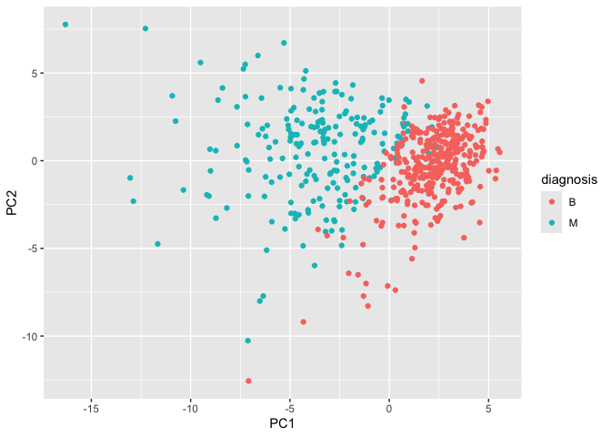
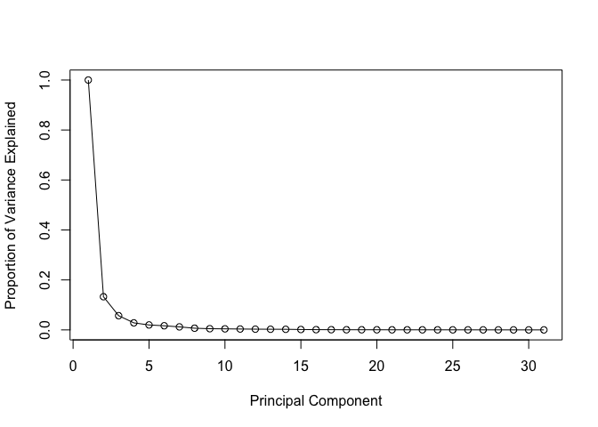
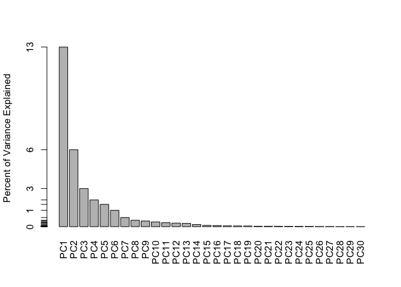

# Class 8 Mini Project
Emma Bell (A19247017)

- [Background](#background)
- [Principle Component Analysis
  (PCA)](#principle-component-analysis-pca)
- [Variance explained](#variance-explained)
- [Communicating PCA results](#communicating-pca-results)
  - [Hiercharchical Clustering](#hiercharchical-clustering)
  - [Combining methods](#combining-methods)
  - [Prediction](#prediction)

## Background

In today’s class we will be employing all the R techniques for dada
analysis that we have learned thus far - including the machine learning
methods of clustering and PCA - to analyse real breast cancer biopsy
data.

Values in this data set describe characteristics of the cell nuclei
present in digitized images of a fine needle aspiration (FNA) of a
breast mass.

FNA is a type of biopsy procedure where a very thin needle is inserted
into an area of abnormal tissue or cells with a guide of CT scan or
ultrasound monitors. The collected sample is then transferred to a
pathologist to study it under a microscope and examine whether cells in
the biopsy are normal or not.

Features measured from the digitized images include:

radius: mean of distances from nucleus center to points on the
perimeter; texture: a measure of nucleus roughness taken from the
standard deviation of gray-scale values; perimeter: total boundary
length of the nucleus, area: total area of the nucleus; smoothness:
local variation in radius lengths, i.e. how “bumpy” the edge is;
compactness: measures how circular vs. irregular the shape is;
concavity: how deeply indented, and symmetry: how symmetric the nucleus
is.

``` r
wisc.df <- read.csv("WisconsinCancer.csv", row.names=1)
```

wee peak at the data

``` r
head(wisc.df, 3)
```

             diagnosis radius_mean texture_mean perimeter_mean area_mean
    842302           M       17.99        10.38          122.8      1001
    842517           M       20.57        17.77          132.9      1326
    84300903         M       19.69        21.25          130.0      1203
             smoothness_mean compactness_mean concavity_mean concave.points_mean
    842302           0.11840          0.27760         0.3001             0.14710
    842517           0.08474          0.07864         0.0869             0.07017
    84300903         0.10960          0.15990         0.1974             0.12790
             symmetry_mean fractal_dimension_mean radius_se texture_se perimeter_se
    842302          0.2419                0.07871    1.0950     0.9053        8.589
    842517          0.1812                0.05667    0.5435     0.7339        3.398
    84300903        0.2069                0.05999    0.7456     0.7869        4.585
             area_se smoothness_se compactness_se concavity_se concave.points_se
    842302    153.40      0.006399        0.04904      0.05373           0.01587
    842517     74.08      0.005225        0.01308      0.01860           0.01340
    84300903   94.03      0.006150        0.04006      0.03832           0.02058
             symmetry_se fractal_dimension_se radius_worst texture_worst
    842302       0.03003             0.006193        25.38         17.33
    842517       0.01389             0.003532        24.99         23.41
    84300903     0.02250             0.004571        23.57         25.53
             perimeter_worst area_worst smoothness_worst compactness_worst
    842302             184.6       2019           0.1622            0.6656
    842517             158.8       1956           0.1238            0.1866
    84300903           152.5       1709           0.1444            0.4245
             concavity_worst concave.points_worst symmetry_worst
    842302            0.7119               0.2654         0.4601
    842517            0.2416               0.1860         0.2750
    84300903          0.4504               0.2430         0.3613
             fractal_dimension_worst
    842302                   0.11890
    842517                   0.08902
    84300903                 0.08758

> Q. How many observations are in this dataset

``` r
nrow(wisc.df)
```

    [1] 569

> Q. How many observations have a malignant diagnosis?

``` r
sum(wisc.df$diagnosis == "M")
```

    [1] 212

or

``` r
table(wisc.df$diagnosis)
```


      B   M 
    357 212 

> Q. How mnay variables/features in the data are suffixed with \_mean?

``` r
colnames(wisc.df)
```

     [1] "diagnosis"               "radius_mean"            
     [3] "texture_mean"            "perimeter_mean"         
     [5] "area_mean"               "smoothness_mean"        
     [7] "compactness_mean"        "concavity_mean"         
     [9] "concave.points_mean"     "symmetry_mean"          
    [11] "fractal_dimension_mean"  "radius_se"              
    [13] "texture_se"              "perimeter_se"           
    [15] "area_se"                 "smoothness_se"          
    [17] "compactness_se"          "concavity_se"           
    [19] "concave.points_se"       "symmetry_se"            
    [21] "fractal_dimension_se"    "radius_worst"           
    [23] "texture_worst"           "perimeter_worst"        
    [25] "area_worst"              "smoothness_worst"       
    [27] "compactness_worst"       "concavity_worst"        
    [29] "concave.points_worst"    "symmetry_worst"         
    [31] "fractal_dimension_worst"

``` r
length(grep("_mean", colnames(wisc.df)))
```

    [1] 10

We need to remove the `diagnosis` column before we do any further
analysis of this dataset - we don’t want to pass this to PCA etc. We
will save it as a separate wee vector that we can use later to compare
out findings tho those of experts.

``` r
diagnosis <- wisc.df$diagnosis
wisc.data <- wisc.df[,-1]
```

## Principle Component Analysis (PCA)

The main function in base R is called `prcomp()` we will use the
optional `scale=TRUE` here as the data columns/features/dimenstions are
on very different scales in the orginial data set.

``` r
wisc.pr <- prcomp(wisc.data, scale=T)
```

``` r
attributes(wisc.pr)
```

    $names
    [1] "sdev"     "rotation" "center"   "scale"    "x"       

    $class
    [1] "prcomp"

``` r
library(ggplot2)
ggplot(wisc.pr$x) +
  aes(PC1, PC2, col=diagnosis) +
  geom_point()
```



``` r
summary(wisc.pr)
```

    Importance of components:
                              PC1    PC2     PC3     PC4     PC5     PC6     PC7
    Standard deviation     3.6444 2.3857 1.67867 1.40735 1.28403 1.09880 0.82172
    Proportion of Variance 0.4427 0.1897 0.09393 0.06602 0.05496 0.04025 0.02251
    Cumulative Proportion  0.4427 0.6324 0.72636 0.79239 0.84734 0.88759 0.91010
                               PC8    PC9    PC10   PC11    PC12    PC13    PC14
    Standard deviation     0.69037 0.6457 0.59219 0.5421 0.51104 0.49128 0.39624
    Proportion of Variance 0.01589 0.0139 0.01169 0.0098 0.00871 0.00805 0.00523
    Cumulative Proportion  0.92598 0.9399 0.95157 0.9614 0.97007 0.97812 0.98335
                              PC15    PC16    PC17    PC18    PC19    PC20   PC21
    Standard deviation     0.30681 0.28260 0.24372 0.22939 0.22244 0.17652 0.1731
    Proportion of Variance 0.00314 0.00266 0.00198 0.00175 0.00165 0.00104 0.0010
    Cumulative Proportion  0.98649 0.98915 0.99113 0.99288 0.99453 0.99557 0.9966
                              PC22    PC23   PC24    PC25    PC26    PC27    PC28
    Standard deviation     0.16565 0.15602 0.1344 0.12442 0.09043 0.08307 0.03987
    Proportion of Variance 0.00091 0.00081 0.0006 0.00052 0.00027 0.00023 0.00005
    Cumulative Proportion  0.99749 0.99830 0.9989 0.99942 0.99969 0.99992 0.99997
                              PC29    PC30
    Standard deviation     0.02736 0.01153
    Proportion of Variance 0.00002 0.00000
    Cumulative Proportion  1.00000 1.00000

> Q4. From your results, what proportion of the original variance is
> captured by the first principal component (PC1)?

0.4427

> Q5. How many principal components (PCs) are required to describe at
> least 70% of the original variance in the data?

PC3 onwards

> Q6. How many principal components (PCs) are required to describe at
> least 90% of the original variance in the data?

PC7 onwards

``` r
biplot(wisc.pr)
```


> Q7. What stands out to you about this plot? Is it easy or difficult to
> understand? Why?

Very chaotic! Very difficult to understand. So lets generate a more
standard scatter plot of each observation along principal components 1
and 2.

this is the graph from above:

``` r
library(ggplot2)
ggplot(wisc.pr$x) +
  aes(PC1, PC2, col=diagnosis) +
  geom_point()
```


> Q8. Generate a similar plot for principal components 1 and 3. What do
> you notice about these plots?

``` r
library(ggplot2)
ggplot(wisc.pr$x) +
  aes(PC1, PC3, col=diagnosis) +
  geom_point()
```


This plot is relatively different to PC1 vs PC2, but essentially shows
the same distribution of B vs M.

# Variance explained

A scree plot shows how much variance each PC captures. We typically look
for an “elbow” — a point where adding more PCs gives diminishing
returns. This can help us decide how many PCs to consider for further
analysis. (Spoiler: some real data sets don’t have a perfect elbow, so
folks will often use a threshold like 70% or 90% cumulative variance
instead.)

``` r
pr.var <- wisc.pr$sdev^2
head(pr.var)
```

    [1] 13.281608  5.691355  2.817949  1.980640  1.648731  1.207357

Calculate the variance explained by each principal component by dividing
by the total variance explained of all principal components. Assign this
to a variable called pve and create a plot of variance explained for
each principal component.

``` r
pve <- (c(pr.var))/100
head(pve)
```

    [1] 0.13281608 0.05691355 0.02817949 0.01980640 0.01648731 0.01207357

``` r
plot(c(1,pve), xlab="Principal Component", ylab = "Proportion of Variance Explained", 
     ylim = c(0, 1), type = "o")
```



Or an alternative barplot:

``` r
barplot(pve, ylab = "Percent of Variance Explained",
     names.arg=paste0("PC",1:length(pve)), las=2, axes = FALSE)
axis(2, at=pve, labels=round(pve,2)*100 )
```



OPTIONAL: There are quite a few CRAN packages that are helpful for PCA.
This includes the factoextra package. Feel free to explore this package.
For example:

``` r
library(factoextra)
```

    Welcome! Want to learn more? See two factoextra-related books at https://goo.gl/ve3WBa

``` r
fviz_eig(wisc.pr, addlabels = TRUE)
```

    Warning in geom_bar(stat = "identity", fill = barfill, color = barcolor, :
    Ignoring empty aesthetic: `width`.


# Communicating PCA results

In this section we will check your understanding of the PCA results, in
particular the “loadings” and “variance explained”.

The loading vector (`wisc.pr$rotation`) tells us which original
measurements contribute most to each PC.

A large PC1 loading value (positive or negative) for one of the 30
original measurements (i.e. features/columns we started with), for
example, would suggest that this feature is an important driver of the
variation we see in the score plot and thus helpful for distinguishing
“M” from “B” samples. Let’s check which features matter most to PC1.

> Q9. For the first principal component, what is the component of the
> loading vector (i.e. wisc.pr\$rotation\[,1\]) for the feature
> concave.points_mean? This tells us how much this original feature
> contributes to the first PC. Are there any features with larger
> contributions than this one?

``` r
wisc.pr$rotation[8,1]
```

    [1] -0.2608538

``` r
wisc.pr$rotation[,1]
```

                radius_mean            texture_mean          perimeter_mean 
                -0.21890244             -0.10372458             -0.22753729 
                  area_mean         smoothness_mean        compactness_mean 
                -0.22099499             -0.14258969             -0.23928535 
             concavity_mean     concave.points_mean           symmetry_mean 
                -0.25840048             -0.26085376             -0.13816696 
     fractal_dimension_mean               radius_se              texture_se 
                -0.06436335             -0.20597878             -0.01742803 
               perimeter_se                 area_se           smoothness_se 
                -0.21132592             -0.20286964             -0.01453145 
             compactness_se            concavity_se       concave.points_se 
                -0.17039345             -0.15358979             -0.18341740 
                symmetry_se    fractal_dimension_se            radius_worst 
                -0.04249842             -0.10256832             -0.22799663 
              texture_worst         perimeter_worst              area_worst 
                -0.10446933             -0.23663968             -0.22487053 
           smoothness_worst       compactness_worst         concavity_worst 
                -0.12795256             -0.21009588             -0.22876753 
       concave.points_worst          symmetry_worst fractal_dimension_worst 
                -0.25088597             -0.12290456             -0.13178394 

so, no, there are no features with larger contributions.

## Hiercharchical Clustering

The goal of this section is to do hierarchical clustering of the
original datato see if there is any obvious grouping into malignant and
benign clusters.

Recall from class that hierarchical clustering does not assume in
advance the number of natural groups that exist in the data (unlike
K-means clustering).

As part of the preparation for hierarchical clustering, the distance
between all pairs of observations needs to be calculated. This “distance
matrix” will be the input for the hclust() function.

One of the optional arguments to hclust() allows you to pick different
ways (a.k.a. “methods”) to link clusters together, with single,
complete, and average being the most common “linkage methods”. You can
explore the effectes of these different methods in this section.

``` r
data.scaled <-scale(wisc.data)
```

``` r
data.dist <- dist(data.scaled)
```

``` r
wisc.hclust <- hclust(data.dist, method= "ward.D2")
```

``` r
plot(wisc.hclust)
abline(wisc.hclust, col="red", lty=2)
```


> Q12. Which method gives your favorite results for the same data.dist
> dataset? Explain your reasoning.

I like `method=ward.D2` as it seems to give a clearer, less chaotic
dendrogram.

## Combining methods

The idea here is that I can take my new variables (the PCs `wisc.pr$x`)
that are better descriptors of the data-set than the original features
(ie the 30 columns in `wisc.data`) and use these as a basis for
clustering.

``` r
pc.dist <- dist(wisc.pr$x[, 1:3])
wisc.pr.hclust <- hclust(pc.dist, method= "ward.D2")
plot(wisc.pr.hclust)
```


The next section covers Q13-14.

``` r
grps <- cutree(wisc.pr.hclust, k=2)
table (grps)
```

    grps
      1   2 
    203 366 

I can now run table() with both my lcustering `grps` and the expert
`diagnosis`

``` r
table(grps, diagnosis)
```

        diagnosis
    grps   B   M
       1  24 179
       2 333  33

``` r
wisc.pr.hclust.clusters <- cutree(wisc.pr.hclust, k=2)
```

Our cluster “1” has 179 “M” diagnosis Our cluster “2” has 333 “B”
diagnosis So cluster “1” is malignant and “2” is benign.

179 TP (true positive) 24 FP 333 TN 33 FN

Sensitivity refers to a test’s ability to correctly detect ill patients
who do have the condition. In our example here the sensitivity is the
total number of samples in the cluster identified as predominantly
malignant (cancerous) divided by the total number of known malignant
samples. In other words: TP/(TP+FN).

> Q14. How well do the hierarchical clustering models you created in the
> previous sections (i.e. without first doing PCA) do in terms of
> separating the diagnoses? Again, use the table() function to compare
> the output of each model (wisc.hclust.clusters and
> wisc.pr.hclust.clusters) with the vector containing the actual
> diagnoses.

``` r
table(wisc.pr.hclust.clusters, diagnosis)
```

                           diagnosis
    wisc.pr.hclust.clusters   B   M
                          1  24 179
                          2 333  33

It does better because it shows the false positives/false nagatives that
we can now not use.

Sensitivity: TP/(TP+FN)

``` r
179/(179+33)
```

    [1] 0.8443396

sensitvity of 1 would be perfect.

Specificity relates to a test’s ability to correctly reject healthy
patients without a condition. In our example specificity is the
proportion of benign (not cancerous) samples in the cluster identified
as predominantly benign that are known to be benign. In other words:
TN/(TN+FP).

Specificity: TN/(TN+FP).

``` r
333/(333+24)
```

    [1] 0.9327731

## Prediction

We can see our PCA model prediction

``` r
url <- "https://tinyurl.com/new-samples-CSV"
new <- read.csv(url)
npc <- predict(wisc.pr, newdata=new)
npc
```

               PC1       PC2        PC3        PC4       PC5        PC6        PC7
    [1,]  2.576616 -3.135913  1.3990492 -0.7631950  2.781648 -0.8150185 -0.3959098
    [2,] -4.754928 -3.009033 -0.1660946 -0.6052952 -1.140698 -1.2189945  0.8193031
                PC8       PC9       PC10      PC11      PC12      PC13     PC14
    [1,] -0.2307350 0.1029569 -0.9272861 0.3411457  0.375921 0.1610764 1.187882
    [2,] -0.3307423 0.5281896 -0.4855301 0.7173233 -1.185917 0.5893856 0.303029
              PC15       PC16        PC17        PC18        PC19       PC20
    [1,] 0.3216974 -0.1743616 -0.07875393 -0.11207028 -0.08802955 -0.2495216
    [2,] 0.1299153  0.1448061 -0.40509706  0.06565549  0.25591230 -0.4289500
               PC21       PC22       PC23       PC24        PC25         PC26
    [1,]  0.1228233 0.09358453 0.08347651  0.1223396  0.02124121  0.078884581
    [2,] -0.1224776 0.01732146 0.06316631 -0.2338618 -0.20755948 -0.009833238
                 PC27        PC28         PC29         PC30
    [1,]  0.220199544 -0.02946023 -0.015620933  0.005269029
    [2,] -0.001134152  0.09638361  0.002795349 -0.019015820

``` r
plot(wisc.pr$x[,1:2], col=grps)
points(npc[,1], npc[,2], col="blue", pch=16, cex=3)
text(npc[,1], npc[,2], c(1,2), col="white")
```


> Q16. Which of these new patients should we prioritize for follow up
> based on your results?

We need to prioritise group 2.
