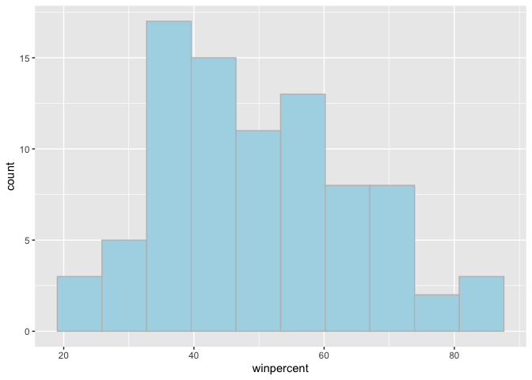
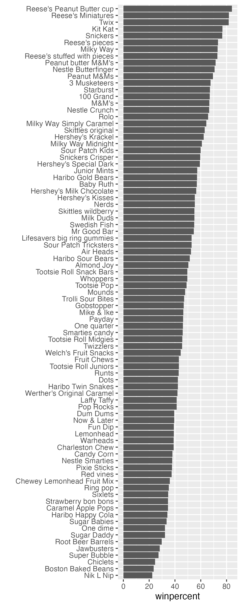
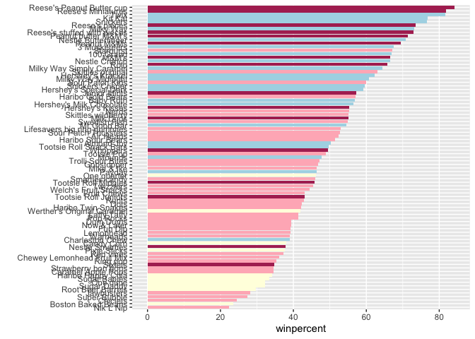
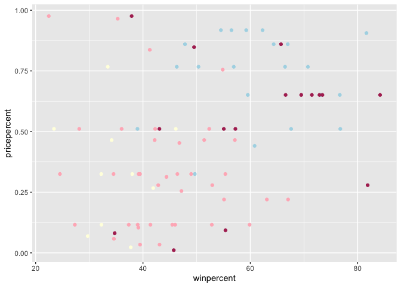
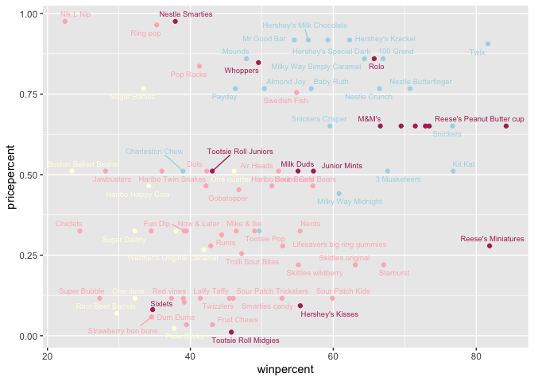
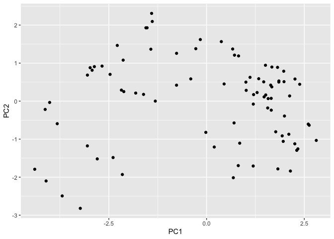
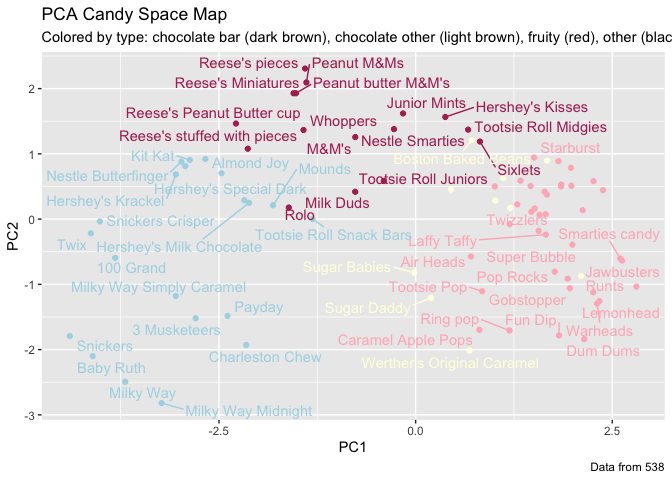

# Class 09
Emma Bell (A19247017)

- [Background](#background)
- [Data Import](#data-import)
- [Side-note: the skimr::skim()
  function](#side-note-the-skimrskim-function)
  - [Exploratory Analysis](#exploratory-analysis)
  - [Overall Candy Rankings](#overall-candy-rankings)
  - [Taking a Look at Pricepercent](#taking-a-look-at-pricepercent)
  - [Exploring the correlation
    structure](#exploring-the-correlation-structure)
  - [Principal Componenet Analysis](#principal-componenet-analysis)

## Background

In today’s mini project we will analyse candy data with the exploratory
graphics, basic statistics, correlation analysis and principal component
analysis methods we have been learning thus far.

We are using FiveThirtyEight’s Halloween Candy dataset. Your task is to
explore their candy dataset to find out answers to these types of
questions: What is the top ranked snack-sized Halloween candy? What made
some candies more desirable than others? Was it price? Maybe it was just
sugar content?

## Data Import

The data comes as a CSV file from 538.

``` r
read.csv("candy-data.csv")
```

                    competitorname chocolate fruity caramel peanutyalmondy nougat
    1                    100 Grand         1      0       1              0      0
    2                 3 Musketeers         1      0       0              0      1
    3                     One dime         0      0       0              0      0
    4                  One quarter         0      0       0              0      0
    5                    Air Heads         0      1       0              0      0
    6                   Almond Joy         1      0       0              1      0
    7                    Baby Ruth         1      0       1              1      1
    8           Boston Baked Beans         0      0       0              1      0
    9                   Candy Corn         0      0       0              0      0
    10          Caramel Apple Pops         0      1       1              0      0
    11             Charleston Chew         1      0       0              0      1
    12  Chewey Lemonhead Fruit Mix         0      1       0              0      0
    13                    Chiclets         0      1       0              0      0
    14                        Dots         0      1       0              0      0
    15                    Dum Dums         0      1       0              0      0
    16                 Fruit Chews         0      1       0              0      0
    17                     Fun Dip         0      1       0              0      0
    18                  Gobstopper         0      1       0              0      0
    19           Haribo Gold Bears         0      1       0              0      0
    20           Haribo Happy Cola         0      0       0              0      0
    21           Haribo Sour Bears         0      1       0              0      0
    22          Haribo Twin Snakes         0      1       0              0      0
    23            Hershey's Kisses         1      0       0              0      0
    24           Hershey's Krackel         1      0       0              0      0
    25    Hershey's Milk Chocolate         1      0       0              0      0
    26      Hershey's Special Dark         1      0       0              0      0
    27                  Jawbusters         0      1       0              0      0
    28                Junior Mints         1      0       0              0      0
    29                     Kit Kat         1      0       0              0      0
    30                 Laffy Taffy         0      1       0              0      0
    31                   Lemonhead         0      1       0              0      0
    32 Lifesavers big ring gummies         0      1       0              0      0
    33         Peanut butter M&M's         1      0       0              1      0
    34                       M&M's         1      0       0              0      0
    35                  Mike & Ike         0      1       0              0      0
    36                   Milk Duds         1      0       1              0      0
    37                   Milky Way         1      0       1              0      1
    38          Milky Way Midnight         1      0       1              0      1
    39    Milky Way Simply Caramel         1      0       1              0      0
    40                      Mounds         1      0       0              0      0
    41                 Mr Good Bar         1      0       0              1      0
    42                       Nerds         0      1       0              0      0
    43         Nestle Butterfinger         1      0       0              1      0
    44               Nestle Crunch         1      0       0              0      0
    45                   Nik L Nip         0      1       0              0      0
    46                 Now & Later         0      1       0              0      0
    47                      Payday         0      0       0              1      1
    48                 Peanut M&Ms         1      0       0              1      0
    49                Pixie Sticks         0      0       0              0      0
    50                   Pop Rocks         0      1       0              0      0
    51                   Red vines         0      1       0              0      0
    52          Reese's Miniatures         1      0       0              1      0
    53   Reese's Peanut Butter cup         1      0       0              1      0
    54              Reese's pieces         1      0       0              1      0
    55 Reese's stuffed with pieces         1      0       0              1      0
    56                    Ring pop         0      1       0              0      0
    57                        Rolo         1      0       1              0      0
    58           Root Beer Barrels         0      0       0              0      0
    59                       Runts         0      1       0              0      0
    60                     Sixlets         1      0       0              0      0
    61           Skittles original         0      1       0              0      0
    62          Skittles wildberry         0      1       0              0      0
    63             Nestle Smarties         1      0       0              0      0
    64              Smarties candy         0      1       0              0      0
    65                    Snickers         1      0       1              1      1
    66            Snickers Crisper         1      0       1              1      0
    67             Sour Patch Kids         0      1       0              0      0
    68       Sour Patch Tricksters         0      1       0              0      0
    69                   Starburst         0      1       0              0      0
    70         Strawberry bon bons         0      1       0              0      0
    71                Sugar Babies         0      0       1              0      0
    72                 Sugar Daddy         0      0       1              0      0
    73                Super Bubble         0      1       0              0      0
    74                Swedish Fish         0      1       0              0      0
    75                 Tootsie Pop         1      1       0              0      0
    76        Tootsie Roll Juniors         1      0       0              0      0
    77        Tootsie Roll Midgies         1      0       0              0      0
    78     Tootsie Roll Snack Bars         1      0       0              0      0
    79           Trolli Sour Bites         0      1       0              0      0
    80                        Twix         1      0       1              0      0
    81                   Twizzlers         0      1       0              0      0
    82                    Warheads         0      1       0              0      0
    83        Welch's Fruit Snacks         0      1       0              0      0
    84  Werther's Original Caramel         0      0       1              0      0
    85                    Whoppers         1      0       0              0      0
       crispedricewafer hard bar pluribus sugarpercent pricepercent winpercent
    1                 1    0   1        0        0.732        0.860   66.97173
    2                 0    0   1        0        0.604        0.511   67.60294
    3                 0    0   0        0        0.011        0.116   32.26109
    4                 0    0   0        0        0.011        0.511   46.11650
    5                 0    0   0        0        0.906        0.511   52.34146
    6                 0    0   1        0        0.465        0.767   50.34755
    7                 0    0   1        0        0.604        0.767   56.91455
    8                 0    0   0        1        0.313        0.511   23.41782
    9                 0    0   0        1        0.906        0.325   38.01096
    10                0    0   0        0        0.604        0.325   34.51768
    11                0    0   1        0        0.604        0.511   38.97504
    12                0    0   0        1        0.732        0.511   36.01763
    13                0    0   0        1        0.046        0.325   24.52499
    14                0    0   0        1        0.732        0.511   42.27208
    15                0    1   0        0        0.732        0.034   39.46056
    16                0    0   0        1        0.127        0.034   43.08892
    17                0    1   0        0        0.732        0.325   39.18550
    18                0    1   0        1        0.906        0.453   46.78335
    19                0    0   0        1        0.465        0.465   57.11974
    20                0    0   0        1        0.465        0.465   34.15896
    21                0    0   0        1        0.465        0.465   51.41243
    22                0    0   0        1        0.465        0.465   42.17877
    23                0    0   0        1        0.127        0.093   55.37545
    24                1    0   1        0        0.430        0.918   62.28448
    25                0    0   1        0        0.430        0.918   56.49050
    26                0    0   1        0        0.430        0.918   59.23612
    27                0    1   0        1        0.093        0.511   28.12744
    28                0    0   0        1        0.197        0.511   57.21925
    29                1    0   1        0        0.313        0.511   76.76860
    30                0    0   0        0        0.220        0.116   41.38956
    31                0    1   0        0        0.046        0.104   39.14106
    32                0    0   0        0        0.267        0.279   52.91139
    33                0    0   0        1        0.825        0.651   71.46505
    34                0    0   0        1        0.825        0.651   66.57458
    35                0    0   0        1        0.872        0.325   46.41172
    36                0    0   0        1        0.302        0.511   55.06407
    37                0    0   1        0        0.604        0.651   73.09956
    38                0    0   1        0        0.732        0.441   60.80070
    39                0    0   1        0        0.965        0.860   64.35334
    40                0    0   1        0        0.313        0.860   47.82975
    41                0    0   1        0        0.313        0.918   54.52645
    42                0    1   0        1        0.848        0.325   55.35405
    43                0    0   1        0        0.604        0.767   70.73564
    44                1    0   1        0        0.313        0.767   66.47068
    45                0    0   0        1        0.197        0.976   22.44534
    46                0    0   0        1        0.220        0.325   39.44680
    47                0    0   1        0        0.465        0.767   46.29660
    48                0    0   0        1        0.593        0.651   69.48379
    49                0    0   0        1        0.093        0.023   37.72234
    50                0    1   0        1        0.604        0.837   41.26551
    51                0    0   0        1        0.581        0.116   37.34852
    52                0    0   0        0        0.034        0.279   81.86626
    53                0    0   0        0        0.720        0.651   84.18029
    54                0    0   0        1        0.406        0.651   73.43499
    55                0    0   0        0        0.988        0.651   72.88790
    56                0    1   0        0        0.732        0.965   35.29076
    57                0    0   0        1        0.860        0.860   65.71629
    58                0    1   0        1        0.732        0.069   29.70369
    59                0    1   0        1        0.872        0.279   42.84914
    60                0    0   0        1        0.220        0.081   34.72200
    61                0    0   0        1        0.941        0.220   63.08514
    62                0    0   0        1        0.941        0.220   55.10370
    63                0    0   0        1        0.267        0.976   37.88719
    64                0    1   0        1        0.267        0.116   45.99583
    65                0    0   1        0        0.546        0.651   76.67378
    66                1    0   1        0        0.604        0.651   59.52925
    67                0    0   0        1        0.069        0.116   59.86400
    68                0    0   0        1        0.069        0.116   52.82595
    69                0    0   0        1        0.151        0.220   67.03763
    70                0    1   0        1        0.569        0.058   34.57899
    71                0    0   0        1        0.965        0.767   33.43755
    72                0    0   0        0        0.418        0.325   32.23100
    73                0    0   0        0        0.162        0.116   27.30386
    74                0    0   0        1        0.604        0.755   54.86111
    75                0    1   0        0        0.604        0.325   48.98265
    76                0    0   0        0        0.313        0.511   43.06890
    77                0    0   0        1        0.174        0.011   45.73675
    78                0    0   1        0        0.465        0.325   49.65350
    79                0    0   0        1        0.313        0.255   47.17323
    80                1    0   1        0        0.546        0.906   81.64291
    81                0    0   0        0        0.220        0.116   45.46628
    82                0    1   0        0        0.093        0.116   39.01190
    83                0    0   0        1        0.313        0.313   44.37552
    84                0    1   0        0        0.186        0.267   41.90431
    85                1    0   0        1        0.872        0.848   49.52411

``` r
candy_file <- "candy-data.csv"
candy = read.csv(candy_file, row.names= 1)
head(candy)
```

                 chocolate fruity caramel peanutyalmondy nougat crispedricewafer
    100 Grand            1      0       1              0      0                1
    3 Musketeers         1      0       0              0      1                0
    One dime             0      0       0              0      0                0
    One quarter          0      0       0              0      0                0
    Air Heads            0      1       0              0      0                0
    Almond Joy           1      0       0              1      0                0
                 hard bar pluribus sugarpercent pricepercent winpercent
    100 Grand       0   1        0        0.732        0.860   66.97173
    3 Musketeers    0   1        0        0.604        0.511   67.60294
    One dime        0   0        0        0.011        0.116   32.26109
    One quarter     0   0        0        0.011        0.511   46.11650
    Air Heads       0   0        0        0.906        0.511   52.34146
    Almond Joy      0   1        0        0.465        0.767   50.34755

\`\`\`

> Q How many different candy types are in this datasubset?

There are 85 rows in this dataset

> Q How many fruity candy types are in the dataset?

``` r
sum(candy$fruity)
```

    [1] 38

One of the most interesting variables in the dataset is winpercent. For
a given candy this value is the percentage of people who prefer this
candy over another randomly chosen candy from the dataset (what 538 term
a matchup). Higher values indicate a more popular candy.

``` r
candy["Twix", ]$winpercent
```

    [1] 81.64291

an alternative way:

``` r
library(dplyr)
```


    Attaching package: 'dplyr'

    The following objects are masked from 'package:stats':

        filter, lag

    The following objects are masked from 'package:base':

        intersect, setdiff, setequal, union

``` r
candy |> 
  filter(row.names(candy)=="Twix") |> 
  select(winpercent)
```

         winpercent
    Twix   81.64291

> Q3. What is your favorite candy (other than Twix) in the dataset and
> what is it’s winpercent value?

``` r
candy["M&M's", ]$winpercent
```

    [1] 66.57458

> Q4. What is the winpercent value for “Kit Kat”?

``` r
candy["Kit Kat", ]$winpercent
```

    [1] 76.7686

> Q5. What is the winpercent value for “Tootsie Roll Snack Bars”?

``` r
candy["Tootsie Roll Snack Bars", ]$winpercent
```

    [1] 49.6535

# Side-note: the skimr::skim() function

There is a useful `skim()` function in the skimr package that can help
give you a quick overview of a given dataset. Let’s install this package
and try it on our candy data.

``` r
library("skimr")
skim(candy)
```

|                                                  |       |
|:-------------------------------------------------|:------|
| Name                                             | candy |
| Number of rows                                   | 85    |
| Number of columns                                | 12    |
| \_\_\_\_\_\_\_\_\_\_\_\_\_\_\_\_\_\_\_\_\_\_\_   |       |
| Column type frequency:                           |       |
| numeric                                          | 12    |
| \_\_\_\_\_\_\_\_\_\_\_\_\_\_\_\_\_\_\_\_\_\_\_\_ |       |
| Group variables                                  | None  |

Data summary

**Variable type: numeric**

| skim_variable | n_missing | complete_rate | mean | sd | p0 | p25 | p50 | p75 | p100 | hist |
|:---|---:|---:|---:|---:|---:|---:|---:|---:|---:|:---|
| chocolate | 0 | 1 | 0.44 | 0.50 | 0.00 | 0.00 | 0.00 | 1.00 | 1.00 | ▇▁▁▁▆ |
| fruity | 0 | 1 | 0.45 | 0.50 | 0.00 | 0.00 | 0.00 | 1.00 | 1.00 | ▇▁▁▁▆ |
| caramel | 0 | 1 | 0.16 | 0.37 | 0.00 | 0.00 | 0.00 | 0.00 | 1.00 | ▇▁▁▁▂ |
| peanutyalmondy | 0 | 1 | 0.16 | 0.37 | 0.00 | 0.00 | 0.00 | 0.00 | 1.00 | ▇▁▁▁▂ |
| nougat | 0 | 1 | 0.08 | 0.28 | 0.00 | 0.00 | 0.00 | 0.00 | 1.00 | ▇▁▁▁▁ |
| crispedricewafer | 0 | 1 | 0.08 | 0.28 | 0.00 | 0.00 | 0.00 | 0.00 | 1.00 | ▇▁▁▁▁ |
| hard | 0 | 1 | 0.18 | 0.38 | 0.00 | 0.00 | 0.00 | 0.00 | 1.00 | ▇▁▁▁▂ |
| bar | 0 | 1 | 0.25 | 0.43 | 0.00 | 0.00 | 0.00 | 0.00 | 1.00 | ▇▁▁▁▂ |
| pluribus | 0 | 1 | 0.52 | 0.50 | 0.00 | 0.00 | 1.00 | 1.00 | 1.00 | ▇▁▁▁▇ |
| sugarpercent | 0 | 1 | 0.48 | 0.28 | 0.01 | 0.22 | 0.47 | 0.73 | 0.99 | ▇▇▇▇▆ |
| pricepercent | 0 | 1 | 0.47 | 0.29 | 0.01 | 0.26 | 0.47 | 0.65 | 0.98 | ▇▇▇▇▆ |
| winpercent | 0 | 1 | 50.32 | 14.71 | 22.45 | 39.14 | 47.83 | 59.86 | 84.18 | ▃▇▆▅▂ |

> Q6. Is there any variable/column that looks to be on a different scale
> to the majority of the other columns in the dataset?

winpercent seems to be on a different scale, as it goes over 50.

> Q7. What do you think a zero and one represent for the
> candy\$chocolate column?

The candy either does or doesnt contain chocolate

## Exploratory Analysis

> Q8. Plot a histogram of winpercent values using both base R an
> ggplot2.

``` r
library(ggplot2)
```

``` r
ggplot(candy) + aes(winpercent) + geom_histogram()
```

    `stat_bin()` using `bins = 30`. Pick better value `binwidth`.


> Q9. Is the distribution of winpercent values symmetrical?

No it is not.

Let’s make the histogram a bit nicer

``` r
ggplot(candy) + aes(winpercent) + geom_histogram(bins=10, fill="lightblue", col="gray")
```



> Q10. Is the center of the distribution above or below 50%?

Below- the highest bin is below 40%

> Q11. On average is chocolate candy higher or lower ranked than fruit
> candy?

Steps: 1. Find all chocolate candy in the dataset 2. Extract or find
their winpercent values 3. Calculate the mean if these values

4.  Find all fruit candy in the dataset
5.  Extract or find their winpercent values
6.  Calculate the mean of these values

``` r
choc.candy <- candy[ candy$chocolate==1, ]
```

``` r
choc.win <- choc.candy$winpercent
mean(choc.win)
```

    [1] 60.92153

``` r
fruit.candy <- candy[ candy$fruity==1, ]
```

``` r
fruit.win <- fruit.candy$winpercent
mean(fruit.win)
```

    [1] 44.11974

So, the mean chocolate is higher

> Q12. Is this difference statistically significant?

``` r
t.test(choc.win, fruit.win)
```


        Welch Two Sample t-test

    data:  choc.win and fruit.win
    t = 6.2582, df = 68.882, p-value = 2.871e-08
    alternative hypothesis: true difference in means is not equal to 0
    95 percent confidence interval:
     11.44563 22.15795
    sample estimates:
    mean of x mean of y 
     60.92153  44.11974 

Yes as the p value is very small

## Overall Candy Rankings

Let’s use the base R order() function together with head() to sort the
whole dataset by winpercent. Or if you have been getting into the
tidyverse and the dplyr package you can use the arrange() function
together with head() to do the same thing and answer the following
questions:

> Q13. What are the five least liked candy types in this set?

``` r
y <- c("z", "b", "c")
sort(y)
```

    [1] "b" "c" "z"

gonna rearrange it alphabetically, numerically etc

``` r
y
```

    [1] "z" "b" "c"

``` r
order(y)
```

    [1] 2 3 1

``` r
y[ order(y)]
```

    [1] "b" "c" "z"

``` r
sort(candy$winpercent)
```

     [1] 22.44534 23.41782 24.52499 27.30386 28.12744 29.70369 32.23100 32.26109
     [9] 33.43755 34.15896 34.51768 34.57899 34.72200 35.29076 36.01763 37.34852
    [17] 37.72234 37.88719 38.01096 38.97504 39.01190 39.14106 39.18550 39.44680
    [25] 39.46056 41.26551 41.38956 41.90431 42.17877 42.27208 42.84914 43.06890
    [33] 43.08892 44.37552 45.46628 45.73675 45.99583 46.11650 46.29660 46.41172
    [41] 46.78335 47.17323 47.82975 48.98265 49.52411 49.65350 50.34755 51.41243
    [49] 52.34146 52.82595 52.91139 54.52645 54.86111 55.06407 55.10370 55.35405
    [57] 55.37545 56.49050 56.91455 57.11974 57.21925 59.23612 59.52925 59.86400
    [65] 60.80070 62.28448 63.08514 64.35334 65.71629 66.47068 66.57458 66.97173
    [73] 67.03763 67.60294 69.48379 70.73564 71.46505 72.88790 73.09956 73.43499
    [81] 76.67378 76.76860 81.64291 81.86626 84.18029

``` r
inds <- order(candy$winpercent)
head(candy[inds, ], 5)
```

                       chocolate fruity caramel peanutyalmondy nougat
    Nik L Nip                  0      1       0              0      0
    Boston Baked Beans         0      0       0              1      0
    Chiclets                   0      1       0              0      0
    Super Bubble               0      1       0              0      0
    Jawbusters                 0      1       0              0      0
                       crispedricewafer hard bar pluribus sugarpercent pricepercent
    Nik L Nip                         0    0   0        1        0.197        0.976
    Boston Baked Beans                0    0   0        1        0.313        0.511
    Chiclets                          0    0   0        1        0.046        0.325
    Super Bubble                      0    0   0        0        0.162        0.116
    Jawbusters                        0    1   0        1        0.093        0.511
                       winpercent
    Nik L Nip            22.44534
    Boston Baked Beans   23.41782
    Chiclets             24.52499
    Super Bubble         27.30386
    Jawbusters           28.12744

head and then comma 5 will show the last five order puts the numerical
order but their position in the table.

> Q14. What are the top 5 all time favorite candy types out of this set?

``` r
inds <- order(candy$winpercent)
tail(candy[inds, ], 5)
```

                              chocolate fruity caramel peanutyalmondy nougat
    Snickers                          1      0       1              1      1
    Kit Kat                           1      0       0              0      0
    Twix                              1      0       1              0      0
    Reese's Miniatures                1      0       0              1      0
    Reese's Peanut Butter cup         1      0       0              1      0
                              crispedricewafer hard bar pluribus sugarpercent
    Snickers                                 0    0   1        0        0.546
    Kit Kat                                  1    0   1        0        0.313
    Twix                                     1    0   1        0        0.546
    Reese's Miniatures                       0    0   0        0        0.034
    Reese's Peanut Butter cup                0    0   0        0        0.720
                              pricepercent winpercent
    Snickers                         0.651   76.67378
    Kit Kat                          0.511   76.76860
    Twix                             0.906   81.64291
    Reese's Miniatures               0.279   81.86626
    Reese's Peanut Butter cup        0.651   84.18029

> Q15. Make a first barplot of candy ranking based on winpercent values.

``` r
ggplot(candy) + aes(winpercent, rownames(candy)) + geom_col()
```


cant read!!!

``` r
ggplot(candy) + aes(winpercent, rownames(candy)) + geom_col() + ylab("") # turn y label off that we dont need
```


``` r
ggsave("barplot1.png", height=10, width=4)
```

bit of a fudge, but youll have to play around

> Q16. This is quite ugly, use the reorder() function to get the bars
> sorted by winpercent?

``` r
ggplot(candy) + aes(winpercent, 
                    reorder( rownames(candy), winpercent)) + geom_col() + ylab("") # turn y label off that we dont need
```


``` r
ggsave("barplot2.png", height=10, width=4)
```



``` r
ggplot(candy) + aes(winpercent, 
                    reorder( rownames(candy), winpercent),
                    fill=chocolate ) +
  geom_col() + 
  ylab("") # turn y label off that we dont need
```


I want custom colours that I pick so we need to make this ourselves

``` r
my_cols <- rep("lightyellow", nrow(candy))
my_cols[candy$chocolate==1] <- "maroon"
my_cols[candy$fruity==1] <- "lightpink"
my_cols[candy$bar==1] <- "lightblue"
my_cols
```

     [1] "lightblue"   "lightblue"   "lightyellow" "lightyellow" "lightpink"  
     [6] "lightblue"   "lightblue"   "lightyellow" "lightyellow" "lightpink"  
    [11] "lightblue"   "lightpink"   "lightpink"   "lightpink"   "lightpink"  
    [16] "lightpink"   "lightpink"   "lightpink"   "lightpink"   "lightyellow"
    [21] "lightpink"   "lightpink"   "maroon"      "lightblue"   "lightblue"  
    [26] "lightblue"   "lightpink"   "maroon"      "lightblue"   "lightpink"  
    [31] "lightpink"   "lightpink"   "maroon"      "maroon"      "lightpink"  
    [36] "maroon"      "lightblue"   "lightblue"   "lightblue"   "lightblue"  
    [41] "lightblue"   "lightpink"   "lightblue"   "lightblue"   "lightpink"  
    [46] "lightpink"   "lightblue"   "maroon"      "lightyellow" "lightpink"  
    [51] "lightpink"   "maroon"      "maroon"      "maroon"      "maroon"     
    [56] "lightpink"   "maroon"      "lightyellow" "lightpink"   "maroon"     
    [61] "lightpink"   "lightpink"   "maroon"      "lightpink"   "lightblue"  
    [66] "lightblue"   "lightpink"   "lightpink"   "lightpink"   "lightpink"  
    [71] "lightyellow" "lightyellow" "lightpink"   "lightpink"   "lightpink"  
    [76] "maroon"      "maroon"      "lightblue"   "lightpink"   "lightblue"  
    [81] "lightpink"   "lightpink"   "lightpink"   "lightyellow" "maroon"     

``` r
ggplot(candy) + aes(winpercent, 
                    reorder( rownames(candy), winpercent),
                     ) +
  geom_col(fill=my_cols) + 
  ylab("") # turn y label off that we dont need
```



> Q17. What is the worst ranked chocolate candy?

Sixlets

> Q18. What is the best ranked fruity candy?

Starbursts

## Taking a Look at Pricepercent

What about value for money? What is the best candy for the least money?
One way to get at this would be to make a plot of winpercent vs the
pricepercent variable. The pricepercent variable records the percentile
rank of the candy’s price against all the other candies in the dataset.
Lower values are less expensive and higher values are more expensive.

Make a plot of winpercent vs pricepercent

``` r
ggplot(candy) +
  aes(winpercent, pricepercent) +
  geom_point(col=my_cols)
```



We can use the **ggrepel** package for better label placement

``` r
library(ggrepel)
ggplot(candy) +
  aes(winpercent, pricepercent, label=rownames(candy)) +
  geom_point(col=my_cols) +
  geom_text_repel(col=my_cols, size=2.5, max.overlaps=8)
```

    Warning: ggrepel: 12 unlabeled data points (too many overlaps). Consider
    increasing max.overlaps



> Q19. Which candy type is the highest ranked in terms of winpercent for
> the least money - i.e. offers the most bang for your buck?

Reese’s miniatures

> Q20. What are the top 5 most expensive candy types in the dataset and
> of these which is the least popular?

Nik L Nip- least popular and very expensive Ring pop, Nestle smarties,
Pop Rocks and Sugar Babies

## Exploring the correlation structure

Pearson correlation values range from -1 to +1

``` r
library(corrplot)
```

    corrplot 0.95 loaded

``` r
cor(candy)
```

                      chocolate      fruity     caramel peanutyalmondy      nougat
    chocolate         1.0000000 -0.74172106  0.24987535     0.37782357  0.25489183
    fruity           -0.7417211  1.00000000 -0.33548538    -0.39928014 -0.26936712
    caramel           0.2498753 -0.33548538  1.00000000     0.05935614  0.32849280
    peanutyalmondy    0.3778236 -0.39928014  0.05935614     1.00000000  0.21311310
    nougat            0.2548918 -0.26936712  0.32849280     0.21311310  1.00000000
    crispedricewafer  0.3412098 -0.26936712  0.21311310    -0.01764631 -0.08974359
    hard             -0.3441769  0.39067750 -0.12235513    -0.20555661 -0.13867505
    bar               0.5974211 -0.51506558  0.33396002     0.26041960  0.52297636
    pluribus         -0.3396752  0.29972522 -0.26958501    -0.20610932 -0.31033884
    sugarpercent      0.1041691 -0.03439296  0.22193335     0.08788927  0.12308135
    pricepercent      0.5046754 -0.43096853  0.25432709     0.30915323  0.15319643
    winpercent        0.6365167 -0.38093814  0.21341630     0.40619220  0.19937530
                     crispedricewafer        hard         bar    pluribus
    chocolate              0.34120978 -0.34417691  0.59742114 -0.33967519
    fruity                -0.26936712  0.39067750 -0.51506558  0.29972522
    caramel                0.21311310 -0.12235513  0.33396002 -0.26958501
    peanutyalmondy        -0.01764631 -0.20555661  0.26041960 -0.20610932
    nougat                -0.08974359 -0.13867505  0.52297636 -0.31033884
    crispedricewafer       1.00000000 -0.13867505  0.42375093 -0.22469338
    hard                  -0.13867505  1.00000000 -0.26516504  0.01453172
    bar                    0.42375093 -0.26516504  1.00000000 -0.59340892
    pluribus              -0.22469338  0.01453172 -0.59340892  1.00000000
    sugarpercent           0.06994969  0.09180975  0.09998516  0.04552282
    pricepercent           0.32826539 -0.24436534  0.51840654 -0.22079363
    winpercent             0.32467965 -0.31038158  0.42992933 -0.24744787
                     sugarpercent pricepercent winpercent
    chocolate          0.10416906    0.5046754  0.6365167
    fruity            -0.03439296   -0.4309685 -0.3809381
    caramel            0.22193335    0.2543271  0.2134163
    peanutyalmondy     0.08788927    0.3091532  0.4061922
    nougat             0.12308135    0.1531964  0.1993753
    crispedricewafer   0.06994969    0.3282654  0.3246797
    hard               0.09180975   -0.2443653 -0.3103816
    bar                0.09998516    0.5184065  0.4299293
    pluribus           0.04552282   -0.2207936 -0.2474479
    sugarpercent       1.00000000    0.3297064  0.2291507
    pricepercent       0.32970639    1.0000000  0.3453254
    winpercent         0.22915066    0.3453254  1.0000000

``` r
cij <- cor(candy)
corrplot(cij)
```


> Q22. Examining this plot what two variables are anti-correlated
> (i.e. have minus values)?

chocolate and fruity, and bar and pluribus

> Q23. Similarly, what two variables are most positively correlated?

chocolate bar and winpercent chocolate and bar, bar and peanutyalmondy

## Principal Componenet Analysis

REMEMBER SCALE=TRUE!

``` r
pca <- prcomp(candy, scale=TRUE)
```

(candy is input)

``` r
summary(pca)
```

    Importance of components:
                              PC1    PC2    PC3     PC4    PC5     PC6     PC7
    Standard deviation     2.0788 1.1378 1.1092 1.07533 0.9518 0.81923 0.81530
    Proportion of Variance 0.3601 0.1079 0.1025 0.09636 0.0755 0.05593 0.05539
    Cumulative Proportion  0.3601 0.4680 0.5705 0.66688 0.7424 0.79830 0.85369
                               PC8     PC9    PC10    PC11    PC12
    Standard deviation     0.74530 0.67824 0.62349 0.43974 0.39760
    Proportion of Variance 0.04629 0.03833 0.03239 0.01611 0.01317
    Cumulative Proportion  0.89998 0.93832 0.97071 0.98683 1.00000

The main results figure: the PCA score plot:

``` r
ggplot(pca$x) +
  aes(PC1, PC2) +
  geom_point()
```



``` r
ggplot(pca$x) +
  aes(PC1, PC2, label=rownames(pca$x)) +
  geom_point(col=my_cols) +
  geom_text_repel(col=my_cols) +
  labs(title="PCA Candy Space Map",
       subtitle="Colored by type: chocolate bar (dark brown), chocolate other (light brown), fruity (red), other (black)",
       caption="Data from 538")
```

    Warning: ggrepel: 29 unlabeled data points (too many overlaps). Consider
    increasing max.overlaps



The “loadings” plot for PC1

``` r
ggplot(pca$rotation) +
  aes(PC1, reorder (rownames(pca$rotation), PC1)) +
  geom_col()
```


> Q24. Complete the code to generate the loadings plot above. What
> original variables are picked up strongly by PC1 in the positive
> direction? Do these make sense to you? Where did you see this
> relationship highlighted previously?

the fruity, hard, pluribus fruits. Yes these make sense, as in our
corrplot, they had correlation too.

> Q25. Based on your exploratory analysis, correlation findings, and PCA
> results, what combination of characteristics appears to make a
> “winning” candy? How do these different analyses (visualization,
> correlation, PCA) support or complement each other in reaching this
> conclusion?

Through our analysis, chocolate are the ‘winning’ candy. We can see this
through the two means of `winpercent` of choc and fruit, with chocolate
having a higher mean. the corrplot showed that chocolate has a higher
correlation with winpercent than fruit. chocolate bars seem to have the
highest distribution in the higher value of winpercent.
