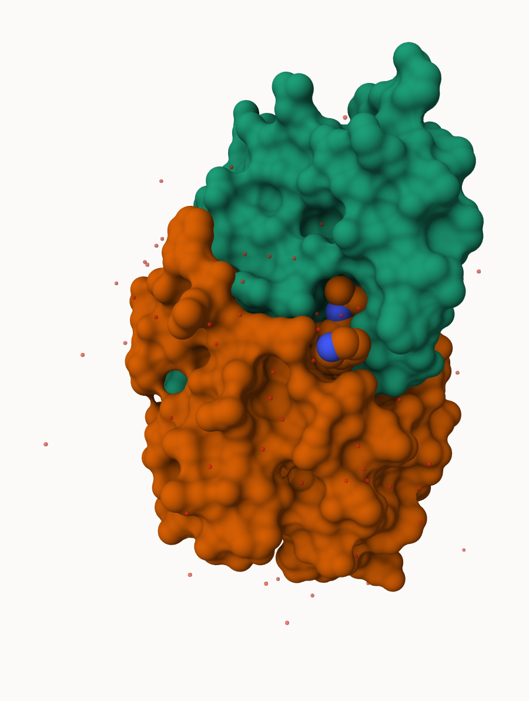
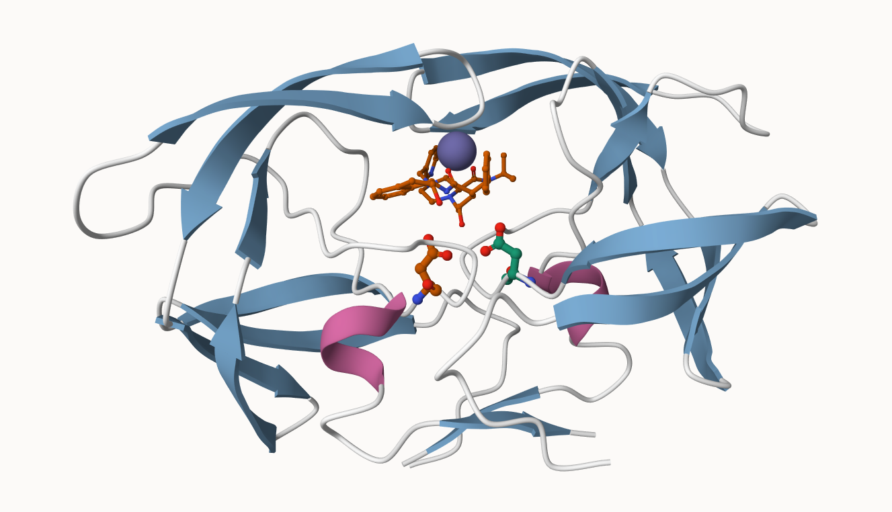

## The PDB database

The [Protein Data Bank (PDB)](http://www.rcsb.org/) is the main repository of biomolecular structure data. let's see what is in it:

> Q1: What percentage of structures in the PDB are solved by X-Ray and Electron Microscopy.

```{r}
stats <- read.csv("pdbstats26.csv", row.names= 1)
stats
```

```{r}
colSums(stats)
```
summary for each column

```{r}
n.sums <- colSums(stats)
n.sums/n.sums["Total"]
```
So X ray would be 80.9% and EM is 12.8%.

If you want to round up to ie 2 sigfigs:

```{r}
n <- n.sums/n.sums["Total"]
round(n, digits=2)
```
> What is the total number of entries in the PDB?

```{r}
n.sums["Total"]
```


> Q2: What proportion of structures in the PDB are protein?

```{r}
178795/249018
```


> Q3: Type HIV in the PDB website search box on the home page and determine how many HIV-1 protease structures are in the current PDB?

We are skipping this one for now.

## Using Molstar

We can use the main [Molstar viewer online](https://molstar.org/viewer/):




> Q. Generate and insert animage of the HIV-Pr cartoon coloured by secondary structure, showing the inhibitor (ligand) in spacefill. 




## The Bio3D package for structural bioinformatics

```{r}
library(bio3d)

hiv <- read.pdb("1hsg")
hiv
```

```{r}
head( hiv$atom )
```

```{r}
pdbseq(hiv)
```
Let's try out the new **bio3dview** package that is not yet on CRAN.
We can use the **remotes** package to install any R package from GitHub.

## Quick viewing of PDB

```{r}
library(bio3dview)
library(NGLVieweR)

sele <- atom.select(hiv, resno=25)

 #view.pdb(hiv, backgroundColor= "lightblue", 
  #       cols=c("navy","lightpink"),
   #      highlight = sele,
    #     highlight.style = "spacefill") |>
#  setRock()
```

## Preciction of Protein flexibility

Reading a new PDB structure of Adenylate Kinase and perform Normal mode analysis

```{r}
adk <- read.pdb("6s36")
```
```{r}
m <- nma(adk)
plot(m)
```

Write out our results as a little trajectory movie

```{r}
mktrj(m, file="results.pdb")
```

```{r}
# view.nma(m)
```

## Comparative protein structure analysis with PCA

we start with a database ID.

```{r}
library(bio3d)

id <- "1ake_A"
aa <- get.seq(id)
```

```{r}
aa
```
```{r}
blast <-  blast.pdb(aa)
```

have a wee peek

```{r}
head(blast$hit.tbl)
```
```{r}
hits <- plot(blast)
```
Each dot is one hit. Ordered by their similarity. Black/red= likes the one above dashline, and to discard the ones below. Can argue with the cut off if need be. 

Peak at our "top hits"

```{r}
head( hits$pdb.id )
```

Now we can download these top hits- these will all be ADK structures in the PDB database

```{r}
files <-get.pdb(hits$pdb.id, path="pdbs", split=TRUE, gzip=TRUE)
```

We need one package from BioConductor. To set this up, we need to first install a package called **"BiocManager"** from CRAN. 

Now we can use the `install()` package from this package like this:
`BiocManager::install("msa")`

```{r}
pdbs <- pdbaln(files, fit = TRUE, exefile="msa") 
```
Let's have a wee peek at our structures after 'fitting' or superposing
```{r}
library(bio3dview)
#view.pdbs(pdbs, colorScheme="residue")
```
We can run functions like `rmsd()` `rmsf()` and the best `pca()`

```{r}
pc.xray <- pca(pdbs)
plot(pc.xray)
```

```{r}
plot(pc.xray, 1:2)
```

show the active and inactive states


Finally lets make a wee movie of the major "motion" or structural difference in the dataset- we call this a "trajectory"

```{r}
mktrj(pc.xray, file="results.pdb")
```


