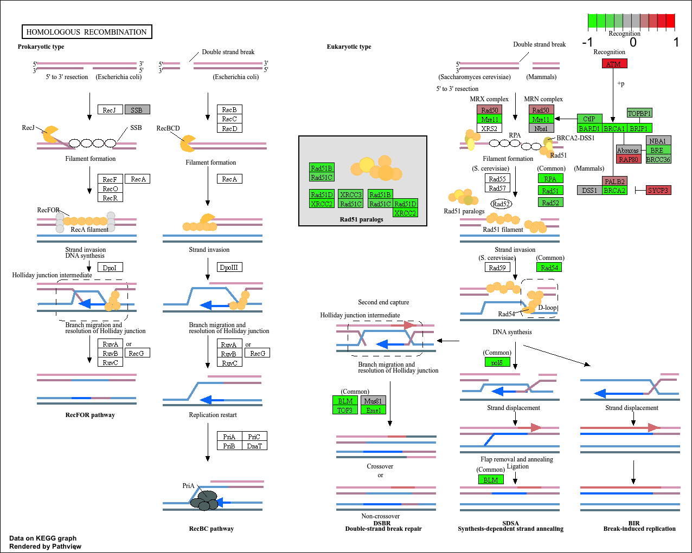
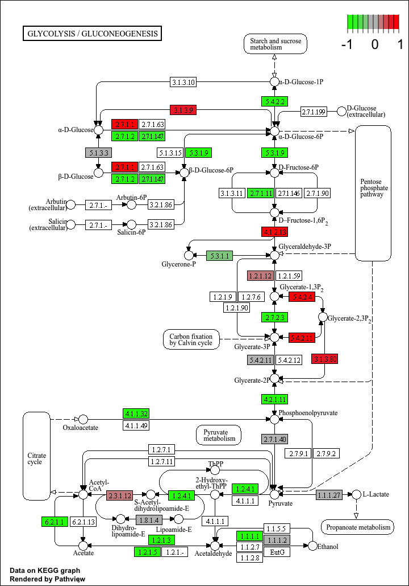

## Background

The data for today's mini project comes from a knock-down study of an important HoX gene. 

## Data Import


```{r}
countData <-  read.csv("GSE37704_featurecounts.csv", row.names=1)
colData <- read.csv("GSE37704_metadata.csv", row.names=1)
```

Have a wee peak at these:

```{r}
head(colData)
```


### Clean Up (data tidying)

We need to remove the first length column

```{r}
countData <- as.matrix(countData[,-1])
head(countData)
```
Now we want to filter count data where you have 0 read counts- we dont want these as they are zeros!!!!

```{r}
countData = countData[rowSums(countData)>0, ]
head(countData)

```

## DESeq Analysis

```{r}

library(DESeq2)

```

### Setting up the DESeq Object

```{r}
dds <- DESeqDataSetFromMatrix(countData=countData,
                              colData=colData,
                              design=~condition)
dds= DESeq(dds)
```

### Running DESeq

```{r}
dds
```

### Getting results

```{r}
res <- results(dds)
res
```
```{r}
summary(res)
```

## Volcano Plot

```{r}
library(ggplot2)

ggplot(res) +
  aes(res$log2FoldChange, -log(res$padj)) +
  geom_point()
```

Lets put in some pretty colours

```{r}
mycols <- rep("lightpink", nrow(res))
mycols[ abs(res$log2FoldChange) > 2] <- "navyblue"

inds <-  (res$padj < 0.01) & (abs(res$log2FoldChange) > 2)
mycols[inds] <- "lightblue"

ggplot(res) +
  aes(res$log2FoldChange, -log(res$padj)) +
  geom_point(col=mycols) +
  geom_vline(xintercept = c(-2,2))+
               geom_hline(yintercept= -log(0.01)) +
   ylab("-Log(P-Value)") +
  xlab("Log2(FoldChange)")
```

## Add Annotation

Now we need to start mapping our Ensemble ids to the gene symbols, names and entrez

```{r}
library("AnnotationDbi")
library("org.Hs.eg.db")
```
We want to use "SYMBOL", "ENTREZID", "GENENAME"

```{r}
res$symbol <- mapIds(org.Hs.eg.db,
                     keys=row.names(res),
                     keytype= "ENSEMBL",
                     column="SYMBOL",
                     multiVals="first")
head(res)
```
```{r}
res$genename <- mapIds(org.Hs.eg.db,
                       keys=row.names(res),
                       keytype="ENSEMBL",
                       column="GENENAME",
                       multiVals="first")
```
```{r}
res$entrez <- mapIds(org.Hs.eg.db,
                     keys=row.names(res),
                     keytype="ENSEMBL",
                     column="ENTREZID",
                     multiVals="first")
head(res)
```

## Pathway Analysis

```{r}
library(pathview)
library(gage)
library(gageData)
```
The gageData package has pre-compiled databases mapping genes to KEGG pathways and GO terms for common organisms. kegg.sets.hs is a named list of 229 elements. Each element is a character vector of member gene Entrez IDs for a single KEGG pathway. (See also go.sets.hs). The sigmet.idx.hs is an index of numbers of signaling and metabolic pathways in kegg.set.gs. In other words, KEGG pathway include other types of pathway definitions, like "Global Map" and "Human Diseases", which may be undesirable in a particular pathway analysis. Therefore, kegg.sets.hs[sigmet.idx.hs] gives you the "cleaner" gene sets of signaling and metabolic pathways only.

### KEGG
```{r}
data(kegg.sets.hs)
data(sigmet.idx.hs)

kegg.sets.hs = kegg.sets.hs[sigmet.idx.hs]

# Examine the first 3 pathways
head(kegg.sets.hs, 3)
```
```{r}
foldchanges = res$log2FoldChange
names(foldchanges) = res$entrez
head(foldchanges)
```
```{r}
keggres = gage(foldchanges, gsets=kegg.sets.hs)
head(keggres$less)
```
```{r}
pathview(gene.data=foldchanges, pathway.id="hsa04110")
```


```{r}
pathview(gene.data=foldchanges, pathway.id="hsa03030")
```

```{r}
pathview(gene.data=foldchanges, pathway.id="hsa03013")
```

```{r}
pathview(gene.data=foldchanges, pathway.id="hsa03440")
```

```{r}
pathview(gene.data=foldchanges, pathway.id="hsa04114")
```

```{r}
pathview(gene.data=foldchanges, pathway.id="hsa00010")
```

### GO

We can also do a similar procedure with gene ontology. Similar to above, go.sets.hs has all GO terms. go.subs.hs is a named list containing indexes for the BP, CC, and MF ontologies. Let’s focus on BP (a.k.a Biological Process) here.


```{r}
data(go.sets.hs)
data(go.subs.hs)

# Focus on Biological Process subset of GO
gobpsets = go.sets.hs[go.subs.hs$BP]

gobpres = gage(foldchanges, gsets=gobpsets)

lapply(gobpres, head)
```

### Reactome

Reactome is database consisting of biological molecules and their relation to pathways and processes. 
Let's now conduct over-representation enrichment analysis and pathway-topology analysis with Reactome using the previous list of significant genes generated from our differential expression results above.

First, using R, output the list of significant genes at the 0.05 level as a plain text file:

```{r}
sig_genes <- res[res$padj <= 0.05 & !is.na(res$padj), "symbol"]
print(paste("Total number of significant genes:", length(sig_genes)))
```
```{r}
write.table(sig_genes, file="significant_genes.txt", row.names=FALSE, col.names=FALSE, quote=FALSE)
```


Then, to perform pathway analysis online go to the Reactome website (https://reactome.org/PathwayBrowser/#TOOL=AT). Select “choose file” to upload your significant gene list. Then, select the parameters “Project to Humans”, then click “Analyze”.


> Q: What pathway has the most significant “Entities p-value”? Do the most significant pathways listed match your previous KEGG results? What factors could cause differences between the two methods?

The Response of EIF2AK4 to amino acid deficiency is the most significant. The cell cycle matches with KEGG, and meiosis. 

The factor that could cause differences is that KEGG is very broad and reactome is very very detailed? 


